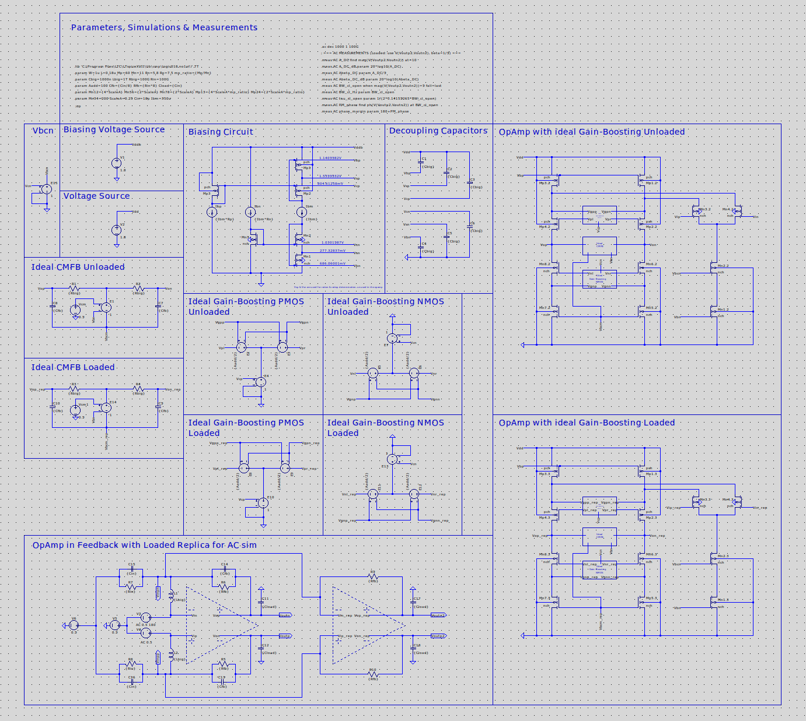
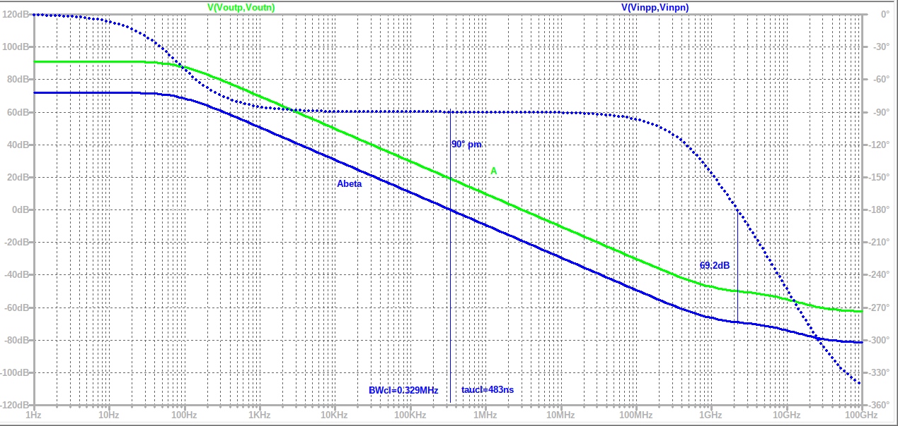
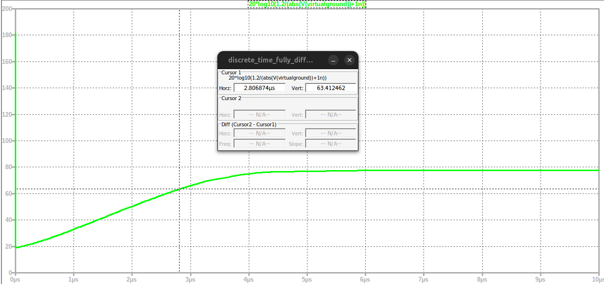

# EE4520 Analog CMOS Design 1

Design homework for EE4520 at TU Delft (design number 27). The main deliverable is a discrete-time fully differential folded-cascode amplifier with ideal gain boosting, designed and verified entirely in LTspice on a 180 nm process. Submitted reports are in `hw1/` and `hw2/` as PDFs; the full simulation set and markdown write-up live next to them.

## The amplifier

Switched-capacitor settling stage: the amplifier sits in capacitive feedback (C_in = 18 pF, C_fb = 2.25 pF, C_load = 18 pF) and must settle a 1.2 V differential output step to 63 dB accuracy within 2.8 μs, at the lowest possible power.

The testbench (`hw2/*.asc`) includes the bias generator, ideal common-mode feedback, ideal gain-boosting sources for the PMOS and NMOS cascodes, and both unloaded and loaded amplifier instances so that open-loop, closed-loop, transient, and noise runs share one consistent operating point.

## Headline results (spec vs achieved)

| Metric | Spec | Achieved |
| --- | --- | --- |
| SNR | 80.64 dB | 80.85 dB |
| Settling accuracy A_settle | 63 dB | 63.32 dB |
| Settling time T_settle | 2800 ns | 2800 ns |
| Power dissipation | lowest possible | 0.112 mW |
| Total integrated output noise | | 76.9 μVrms |
| FoM_dB = −10·log₁₀(2π·P·T/SNR²) | ≥ 174.00 dB | 175.20 dB |

Closed-loop bandwidth from open-loop and closed-loop AC sims agree at 329 kHz, and the transient time constant (497 ns) matches the AC prediction (483 ns) within 3%.

## Deliverables and plots

All in `hw2/report/`, generated from the four simulation decks (AC unloaded, AC loaded, transient, noise):

- Loop gain A·β and open-loop gain Bode plots, loaded and unloaded (deliverable 4)
- Closed-loop gain Bode plot (deliverable 5)
- Settling accuracy versus time, with the extracted time constant (deliverables 6, 7)
- Output noise power density versus frequency (deliverable 8)
- Annotated schematics with all node voltages and branch currents (deliverables 2, 3)

## HW1: device characterization

`hw1/` characterizes the NMOS and PMOS devices as switch resistances: DC sweeps of on-resistance for both polarities and output resistance extraction at several drain currents, with schematics and plots (`sim1_*`, `sim2_*`) plus the submitted report.

## Repository layout

| Path | Contents |
| --- | --- |
| `hw1/` | Switch resistance characterization: schematics, sweeps, report PDF |
| `hw2/` | Folded-cascode design: LTspice decks (AC, transient, noise), results |
| `hw2/report/` | Deliverable table, annotated schematics, all plots, `report.md` |
| `log018.l` | 180 nm model library used by the simulations |
