# HW2 - EE4520 Analog CMOS Design 1 (2025-2026) - Full Design Context

## Student Info
- **Student Number:** 5714699
- **Course:** EE4520 Analogue CMOS Design 1
- **Assignment:** Homework 2 - Discrete-Time Fully Differential Folded-Cascode Amplifier

---

## MY PERSONAL TARGET SPECIFICATIONS (Design Number 27)

| Parameter        | Value  |
|------------------|--------|
| Design number    | 27     |
| A_settle [dB]    | 63     |
| T_settle [us]    | 2.8    |
| SNR [dB]         | 80.64  |
| Bonus [dB]       | 0      |

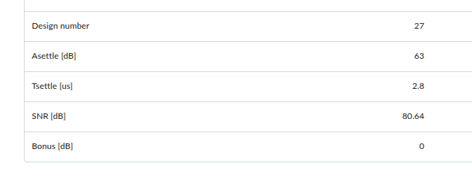

### Derived Values from My Specs
- **A_cl (closed-loop gain):** 8x = 18.06 dB
- **Output step voltage:** 1.2 V_pd (peak-differential)
- **Input step voltage:** 1.2 / A_cl = 1.2 / 8 = 0.150 V = **150 mV**
- **Maximum output signal (rms):** 0.8485 V_rms
- **SNR_linear:** 10^(80.64/20) = 10^4.032 = **10,764.5** (linear)
- **Integrated output noise (from SNR):** 0.8485 / SNR_linear = 0.8485 / 10764.5 = **78.8 uV_rms** (target, lower = better for FoM but must meet spec)

---

## 1. INTRODUCTION & OVERVIEW

Design a **discrete-time fully differential folded-cascode amplifier** to meet individual specifications.

### Key System Parameters (Common to All Students)
- **Closed-loop gain:** A_cl = 8x (18.06 dB)
- **Technology:** 0.18 um CMOS
- **Supply voltage:** V_dd = 1.8 V
- **Biasing supply:** V_ddb = 1.8 V (separate supply for biasing, excluded from power calculation)
- **Common-mode output level:** 0.9 V

### Feedback Network (Fig. 1 - OpAmp in feedback situation)
The OpAmp operates in a fully-differential feedback configuration:
- **R_in = 100 GOhm** (biasing only, effectively open for signal)
- **R_fb = A_cl * R_in = 800 GOhm** (biasing only)
- **C_fb = C_in / A_cl** (feedback capacitor, ratio sets closed-loop gain)
- **C_load = C_in** (load capacitance equals input capacitance)
- The absolute values of C_in and C_load are free to choose - they affect settling time and noise

#### Feedback Topology (Fig. 1)

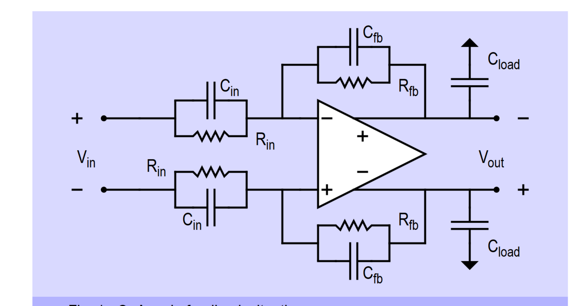

- Top path: + input -> C_in -> OpAmp(-) -> C_fb -> V_out-
- Bottom path: - input -> C_in -> OpAmp(+) -> C_fb -> V_out+
- Fully differential: both + and - paths are symmetric
- C_load on each output to ground

---

## 2. OPAMP SCHEMATIC (Fig. 2 - Folded Cascode with Ideal Gain-Boosting)

### Circuit Architecture
Folded-cascode OpAmp with:
- **Ideal gain-boosting** (PMOS and NMOS sides)
- **Ideal common-mode feedback (CMFB)**
- Fully differential

### Full OpAmp Schematic (Fig. 2)

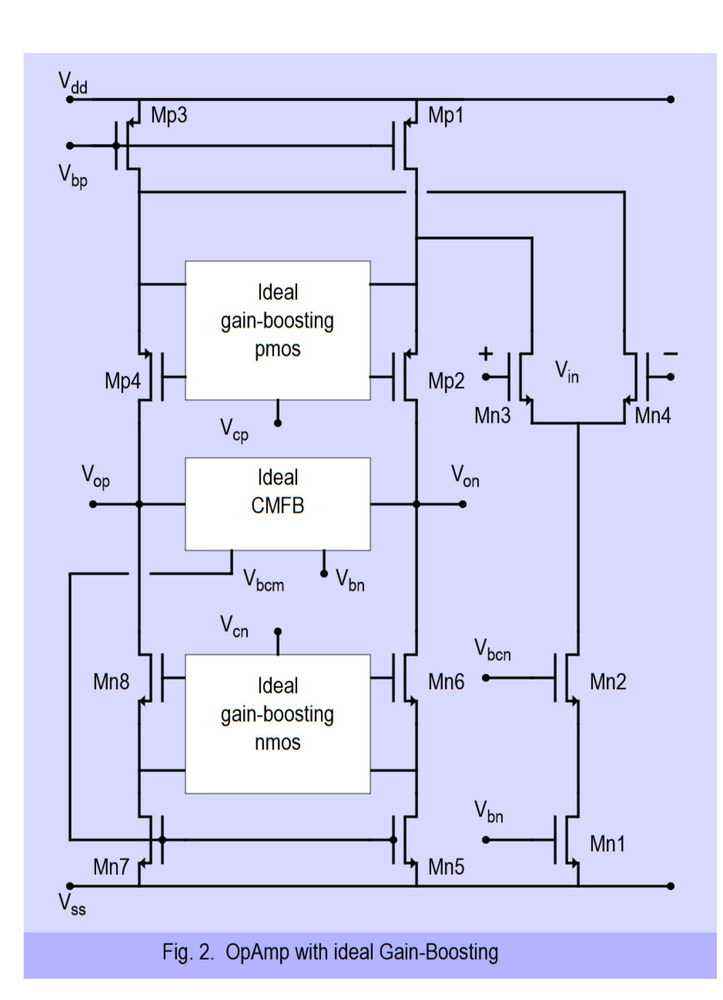

### Transistor Function Summary
| Transistor | Function |
|------------|----------|
| Mp1, Mp3   | PMOS current source (cascode top, connected to V_dd) |
| Mp2, Mp4   | PMOS cascode transistors (gate = V_cp) |
| Mn3, Mn4   | NMOS input differential pair (gates = V_in+, V_in-) |
| Mn1, Mn2   | NMOS current source (bottom, gate = V_bn) |
| Mn5, Mn6   | NMOS cascode transistors (gate = V_bcn) |
| Mn7, Mn8   | NMOS tail current source (bottom, gate = V_bn) |

### Signal Flow
1. Differential input applied to Mn3/Mn4 gates
2. Mn3/Mn4 steer current between left (Mp3/Mp4/Mn7/Mn8) and right (Mp1/Mp2/Mn5/Mn6/Mn1/Mn2) branches
3. Output taken at V_op and V_on (between PMOS cascode and NMOS cascode)
4. Gain-boosting amplifiers increase output impedance of cascode devices
5. CMFB regulates common-mode output to 0.9V

### Important Connections
- **NMOS back-gates -> V_ss** (all NMOS bulk to ground)
- **PMOS back-gates -> V_dd** (all PMOS bulk to supply)

---

## 3. IDEAL GAIN-BOOSTING IMPLEMENTATION

### PMOS Gain-Boosting (Fig. 3)

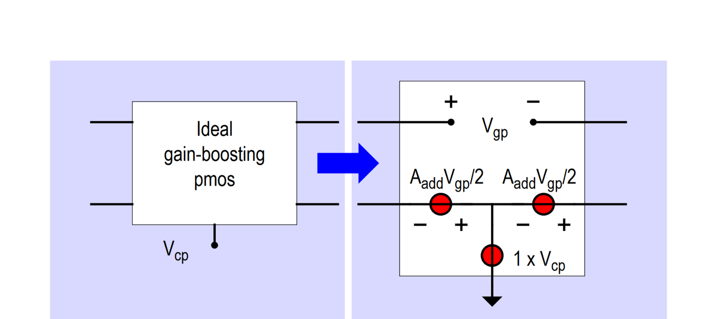

- 3 terminals: top (to Mp2/Mp4 drain-side), bottom (V_cp reference), output (to Mp2/Mp4 gate)
- Implementation: Two voltage-controlled voltage sources (VCVS)
  - Sense voltage V_gp across the cascode device
  - Output: A_add * V_gp / 2 on each side (differential)
  - Plus a 1x buffer copying V_cp
- **A_add = 100x**

### NMOS Gain-Boosting (Fig. 4)

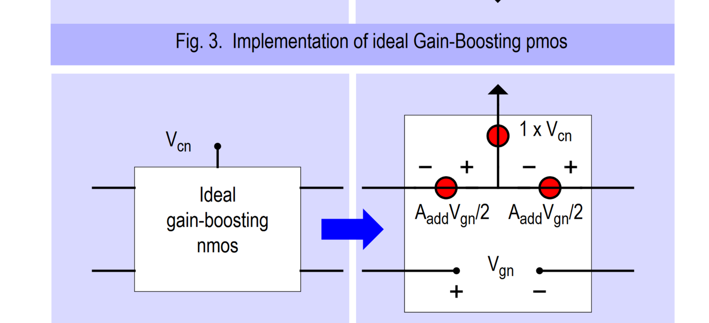

- 3 terminals: top (V_cn reference), bottom (to Mn6/Mn8 source-side), output (to Mn6/Mn8 gate)
- Implementation: Two VCVS
  - Sense voltage V_gn across the cascode device
  - Output: A_add * V_gn / 2 on each side
  - Plus a 1x buffer copying V_cn
- **A_add = 100x**

### Key Point About Ideal Components
- The red sources in Figs 3, 4, 5 are **voltage-controlled voltage sources**
- They mimic an amplifier/buffer behavior with specified gain
- No frequency-dependent behavior (ideal, infinite bandwidth)
- A_add = 100 for both NMOS and PMOS gain boosters

---

## 4. IDEAL CMFB IMPLEMENTATION (Fig. 5)

### CMFB Circuit

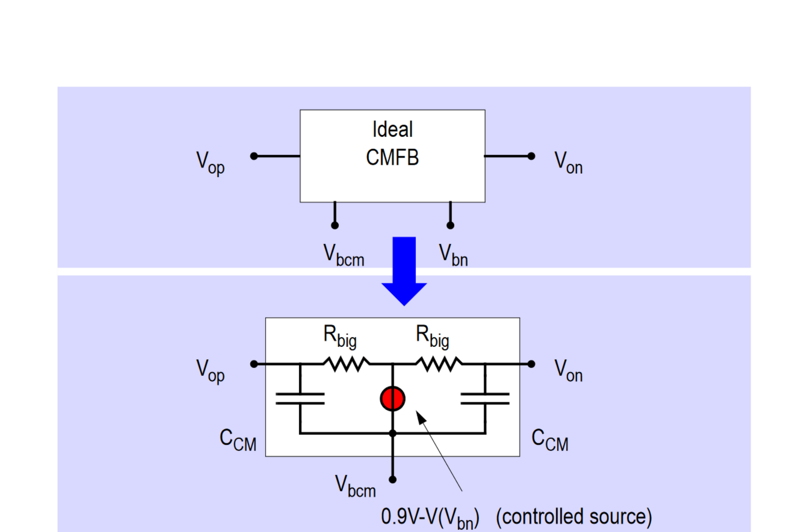

- Senses output CM level via two large resistors R_big from V_op and V_on
- Controlled source: outputs (0.9V - V(V_bn)) to set V_bcm
- C_CM capacitors for high-frequency CM feedback
- **C_CM = C_fb = C_in / 8**
- **R_big:** Choose very large (e.g., 100 GOhm) so it doesn't load the output
- **C_big for decoupling:** ~1 uF on all bias lines

---

## 5. BIASING CIRCUIT (Fig. 6 - From HW1)

### Biasing Block
Uses the biasing block designed in HW1. The biasing circuit generates:
- **V_bp:** PMOS current mirror gate bias
- **V_sp:** PMOS cascode gate bias
- **V_cp:** PMOS cascode gate bias for folded cascode
- **V_cn:** NMOS cascode gate bias
- **V_sn:** NMOS cascode gate bias
- **V_bn:** NMOS current mirror gate bias

### Biasing Schematic (Fig. 6)

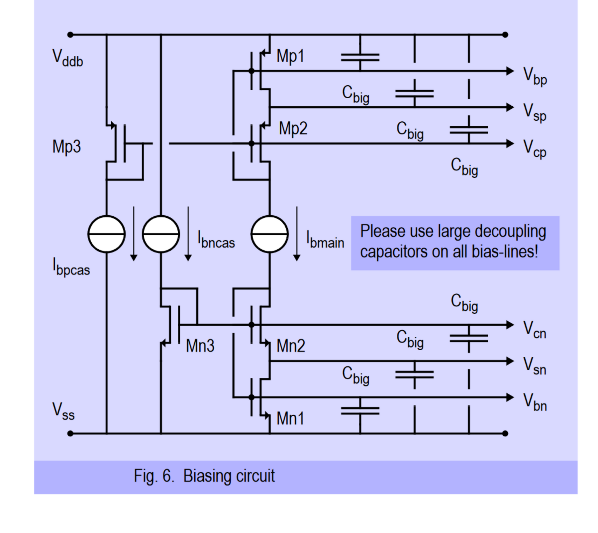

### Critical Biasing Relations
- **I_b,ncas = ratio_n * I_b,main** (from HW1)
- **I_b,pcas = ratio_p * I_b,main** (from HW1)
- **You may need to adjust voltages/currents for optimal results**
- Use **separate supply V_ddb = 1.8V** for biasing (excluded from power dissipation)
- Use **large decoupling capacitors (~1 uF) on ALL bias lines**

---

## 6. TRANSISTOR SIZING RULES

### RULE #1: Unit Transistor
- **W = 1.0 um** (unit finger width)
- **L = 0.18 um** (unit finger length)
- **m = free to choose** (number of fingers / multiplier)
- Non-integer (fractional) m values are ALLOWED for this HW

### RULE #2: Current Ratios and m-Parameter Scaling

#### Required Current Ratios (for proper operation when diff pair steers fully)
```
I_d,MN1 = 2 * I_d,MN5 = 2 * I_d,MN7
I_d,MP1 = I_d,MP3 = I_d,MN1
```

#### NMOS m-parameters
| Transistor | m-factor |
|------------|----------|
| MN1, MN2   | m = 4 * ScaleA |
| MN5, MN6   | m = 2 * ScaleA |
| MN7, MN8   | m = 2 * ScaleA |
| MN3, MN4   | m = 2 * ScaleA (suggested starting point) |

#### PMOS m-parameters
| Transistor | m-factor |
|------------|----------|
| MP1, MP3   | m = 4 * ScaleA * mp-ratio |
| MP2, MP4   | m = 2 * ScaleA * mp-ratio |

Where:
- **ScaleA** = scaling parameter for entire OpAmp (main design variable, YOU choose this)
- **mp-ratio** = ratio between N- and PMOS transistors (from HW1 biasing, to get correct biasing)

---

## 7. CAPACITOR RELATIONSHIPS

| Capacitor | Relation | Notes |
|-----------|----------|-------|
| C_in      | Free to choose | Main design variable (affects noise, settling, bandwidth) |
| C_fb      | C_in / A_cl = C_in / 8 | Sets closed-loop gain |
| C_load    | = C_in | Load capacitance equals input capacitance |
| C_CM      | = C_fb = C_in / 8 | Common-mode feedback capacitor |
| R_big     | Very large (e.g., 100 GOhm) | For CMFB DC sensing |
| C_big     | ~1 uF (1000 nF) | Decoupling on all bias lines |

### Capacitor Value Impact
- **Larger C_in:** Lower noise (better SNR), but slower settling (more charge to move), more power needed
- **Smaller C_in:** Faster settling, less power, but more noise (worse SNR)
- The art is finding the sweet spot that meets BOTH A_settle and SNR specs with minimum power

---

## 8. SIMULATION REQUIREMENTS

### 8.1 Transient Simulation (Step Response)
- **Output step:** 1.2 V_pd (peak-differential)
- **Input step:** 1.2 / A_cl = 1.2 / 8 = **150 mV**
- **Max output signal (rms):** 0.8485 V_rms
- Must show settling to A_settle = **63 dB** within T_settle = **2.8 us**
- Plot settling accuracy vs time using:
  ```
  Accuracy_dB = 20 * log10( 1.2V / (abs(V(virtualground)) + 1n) )
  ```
  - Use fixed 1.2V as numerator (NOT V(out))
  - The +1n prevents log(0) issues
- Also measure: T_40dB, T_48.69dB, and derive tau_cl from the settling curve

### 8.2 AC Simulation (A and A*beta)
- **Frequency range:** 1 Hz to 100 GHz
- **Plot 1:** Open-loop gain A and loop gain A*beta [dB] vs frequency
  - Show gain margin and phase margin
  - Indicate BW_cl and tau_cl
- **Plot 2:** Closed-loop gain vs frequency (should show 8x = 18.06 dB)
  - Show -3dB bandwidth

#### Professor's A*beta Simulation Setup (from TA Guidelines)

**How to measure A and A*beta:**
Break the loop by placing a **large inductor** (L_big) between the virtual ground node and the feedback network. Completely removing the connection is also acceptable, but the inductor allows DC biasing to still work.

- Apply AC input to the virtual ground node
- **A (open-loop gain):** Measure Vout+ - Vout-
- **A*beta (loop gain):** Measure Vinp+ - Vinp- (the node between input network and feedback network)

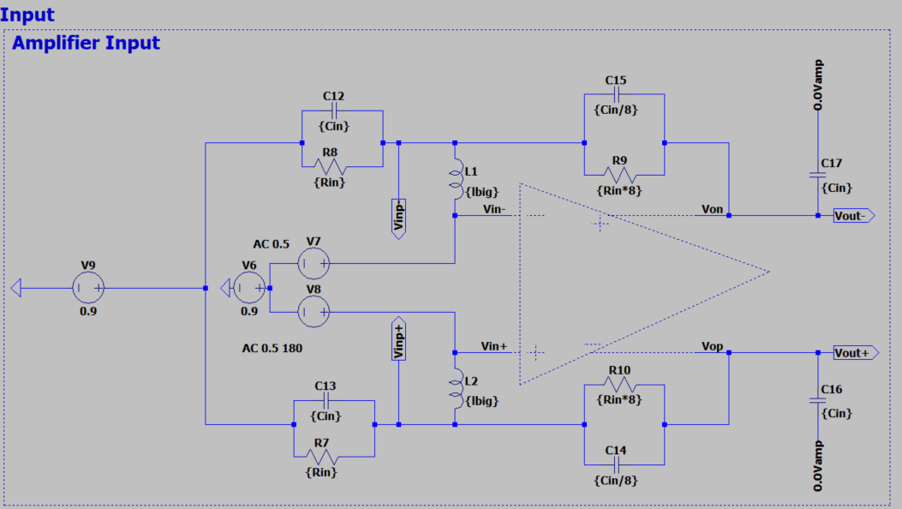

**Key details visible in the schematic above:**
- V9 (0.9V DC) sets the common-mode level
- V7 provides AC stimulus: `AC 0.5` at 0 deg (to Vinp node, negative input side)
- V8 provides AC stimulus: `AC 0.5 180` (to Vinp+ node, positive input side) — these together create a 1V differential AC signal
- L1, L2 = `{lbig}` — large inductors that break the AC loop while maintaining DC bias
- C12, C13 = `{Cin}` — input capacitors
- R8, R7 = `{Rin}` — input biasing resistors
- C15, C14 = `{Cin/8}` — feedback capacitors (= C_fb)
- R9, R10 = `{Rin*8}` — feedback biasing resistors (= R_fb)
- C17, C16 = `{Cin}` — load capacitors (= C_load)
- 0.0Vamp sources on outputs for current measurement

#### Professor's Whiteboard: Loop-Breaking with Replica

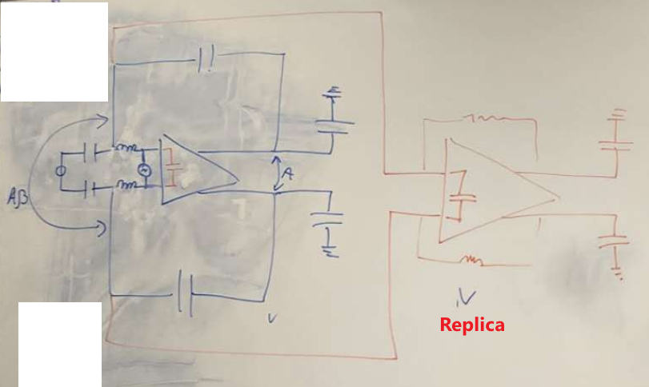

**Interpretation:** For a loaded simulation setup, you can load the output by adding a **dummy (replica) amplifier** which is a copy of your main amplifier. This ensures the output sees the correct loading during AC analysis. The left side (blue) shows the main amplifier with loop broken (A*beta labeled), and the right side (red, labeled "Replica") shows the dummy load. Note: this is just one way to break the loop — other approaches are also acceptable.

### 8.3 Noise Simulation
- **Frequency range:** 10 kHz to 100 GHz (NOT the same as AC!)
- **DO NOT integrate from lower than 10 kHz** (model has 1/f artifacts at very low freq)
- Use special parameter set: **'logic018 no1of.l'** (no 1/f noise)
- Also needs file: **'log018 Delft no1of.txt'**
- Show output noise (Onoise) power density vs frequency
- Show integrated noise value

---

## 9. GOAL & FIGURE OF MERIT

### Primary Goal
Achieve all target specs with the **lowest possible power dissipation**.

### Power Measurement
- From transient simulation: plot current drawn from V_dd
- Power = **average I(V_dd) * V_dd (1.8V)**
- Current from V_ddb (biasing) is EXCLUDED
- The current in V_dd should reflect ONLY the OpAmp circuit current

### FoM Calculation
```
FoM_lin = 2*pi * Power * T_8.6dB / (SNR_lin)^2    [Joules]
FoM_dB  = -10 * log10(FoM_lin)                      [dB, positive number]
```

Where:
- T_8.6dB = T_48.69dB from settling (time to reach accuracy of 48.69 dB)
  - Note: 48.69 dB = A_settle - (A_settle - 40) * (48.69 - 40)/(A_settle - 40) ... actually:
  - For the table: T_48.69dB is the time to reach 48.69 dB accuracy
  - The FoM uses T_8.6dB which equals T_48.69dB (this is ~8.69 dB below final accuracy for some reference designs, but the table says T_8.6dB specifically)

**Actually from the table:**
- Row 23: FoM_lin = 2*pi * Power * T_8.6dB / SNR_lin^2
- The "8.6dB" here refers to a specific settling point

### Targets
- **FoM_dB >= 174 dB** (minimum for all students)
- Best designs may exceed 176 dB
- **Bonus points on FoM_dB:** 0 dB (for my design number 27)

### Over-Design Warning
- Over-designing does NOT give extra points
- Over-designing wastes power and hurts FoM
- Goal: get **as close as possible** to specs, not exceed them
- Falling short of specs results in a penalty

---

## 10. DELIVERABLES (Compulsory Report Structure)

| Page | Deliverable | Content |
|------|-------------|---------|
| 1    | Title Page  | Name + Student Number 5714699 + EE4520 2025/2026 |
| 2    | Del. 1      | Table of Results (see Table 1 template below) |
| 3    | Del. 2      | Schematic with all node voltages (hand-drawn style, NOT simulator screenshot) |
| 4    | Del. 3      | Schematic with all branch currents (hand-drawn style) |
| 5    | Del. 4      | Bode-diagram of A and A*beta (gain [dB] and phase), show BW_cl and tau_cl |
| 6    | Del. 5      | Bode-diagram of closed-loop gain (18.06 dB), show BW_cl |
| 7    | Del. 6      | Settling accuracy vs time (show achieved accuracy at given time) |
| 8    | Del. 7      | Settling accuracy vs time with T_settle, T_40dB, T_48.69dB indicated |
| 9    | Del. 8      | Output noise power density vs frequency (10kHz-100GHz), show integrated noise |
| 10   | Del. 9      | Short description of design process (max 1 page, **20% of final grade**) |

### Table of Results Template (Deliverable 1)

| Item | Design Item | Unit | Spec | Achieved |
|------|-------------|------|------|----------|
| 1  | Design Number | - | 27 | 27 |
| 2  | SNR | [dB] | 80.64 | ??? |
| 3  | A_settle | [dB] | 63 | ??? |
| 4  | T_settle | [us] | 2.8 | ??? |
| 5  | BW_cl from open-loop AC sims | [MHz] | --- | ??? |
| 6  | BW_cl from closed-loop AC sims | [MHz] | --- | ??? |
| 7  | tau_cl from closed-loop AC sims | [us] | --- | ??? |
| 8  | T_40dB (time to reach 40 dB accuracy) | [us] | --- | ??? |
| 9  | T_48.69dB (time to reach 48.69 dB accuracy) | [us] | --- | ??? |
| 10 | tau_cl from transient simulation | [us] | --- | ??? |
| 11 | Power dissipation | [uW] | Lowest possible | ??? |
| 12 | I(V_dd) | [uW] | Lowest possible | ??? |
| 13 | Total integrated noise | [uV_rms] | --- | ??? |
| 14 | Input step voltage | [mV] | 150 | 150 |
| 15 | Output step voltage | [V] | 1.2 | 1.2 |
| 16 | C_in | [pF] | --- | ??? |
| 17 | C_fb | [pF] | --- | ??? |
| 18 | C_load | [pF] | --- | ??? |
| 19 | C_CM | [pF] | --- | ??? |
| 20 | R_big | [GOhm] | Big | ??? |
| 21 | C_big | [nF] | Big | ??? |
| 22 | Bonus points on FoM_dB | [dB] | 0 | 0 |
| 23 | FoM_lin = 2pi*Power*T_8.6dB / SNR_lin^2 | [J] | <= 3.98e-18 | ??? |
| 24 | FoM_dB = -10*log10(FoM_lin) | [dB] | >= 174.0 | ??? |

---

## 11. KEY DESIGN EQUATIONS & RELATIONSHIPS

### Closed-Loop Gain
```
A_cl = C_in / C_fb = 8
```

### Closed-Loop Bandwidth & Time Constant
```
BW_cl = f_unity / A_cl        (from open-loop unity-gain frequency)
tau_cl = 1 / (2*pi*BW_cl)
```

### Settling Accuracy
```
Accuracy_dB(t) = 20 * log10( 1.2 / (abs(V(virtualground)) + 1n) )
```

### Settling Time Relationship
For a first-order system settling exponentially:
```
A_settle [dB] = 20 * log10(e) * (T_settle / tau_cl)
             = 8.686 * T_settle / tau_cl
```
So:
```
tau_cl = 8.686 * T_settle / A_settle
```

For my specs:
```
tau_cl = 8.686 * 2.8us / 63 = 0.386 us = 386 ns
BW_cl = 1 / (2*pi*tau_cl) = 1 / (2*pi*386ns) = 0.412 MHz
f_unity = A_cl * BW_cl = 8 * 0.412 MHz = 3.30 MHz
```

### SNR
```
SNR [dB] = 20 * log10(V_signal_rms / V_noise_rms)
80.64 = 20 * log10(0.8485 / V_noise)
V_noise = 0.8485 / 10^(80.64/20) = 0.8485 / 10764.5 = 78.8 uV_rms
```

### FoM
```
FoM_lin = 2*pi * Power[W] * T_8.6dB[s] / (SNR_lin)^2
FoM_dB = -10 * log10(FoM_lin)
```
Target: FoM_dB >= 174 dB

### tau_cl from Transient (Deliverable 7)
```
tau_cl = (T_48.69dB - T_40dB) / ((48.69 - 40) / 8.686)
       = (T_48.69dB - T_40dB) / 1.0
       = T_48.69dB - T_40dB
```
Actually more precisely:
```
For exponential settling: accuracy(t) = 8.686 * t / tau_cl
At 40 dB:    40 = 8.686 * T_40dB / tau_cl    -> T_40dB = 40 * tau_cl / 8.686
At 48.69 dB: 48.69 = 8.686 * T_48.69dB / tau_cl -> T_48.69dB = 48.69 * tau_cl / 8.686

tau_cl = (T_48.69dB - T_40dB) * 8.686 / (48.69 - 40) = (T_48.69dB - T_40dB) * 8.686 / 8.69
       ~ (T_48.69dB - T_40dB)
```

---

## 12. DESIGN STRATEGY (Senior Designer Notes)

### Design Variables (Knobs to Turn)
1. **ScaleA** - Scales all transistor m-parameters proportionally. Larger = more current = more gm = faster but more power
2. **C_in** (and consequently C_fb, C_load, C_CM) - Affects noise and settling
3. **I_b,main** (bias current) - Can be adjusted independently of ScaleA via biasing block
4. **mp-ratio** - From HW1, ratio of PMOS to NMOS sizing
5. **MN3,4 sizing** - Input pair size affects noise and input capacitance

### Design Trade-offs
| Increase | Effect on Settling | Effect on Noise | Effect on Power |
|----------|-------------------|-----------------|-----------------|
| ScaleA   | Faster (more gm)  | Lower (more gm) | Higher |
| C_in     | Slower (more charge) | Lower (more averaging) | Neutral (but need more gm) |
| I_bias   | Faster (more gm) | Lower (more gm) | Higher |
| MN3,4 size | Faster (if gm-limited) | Lower (bigger input pair) | Slightly higher |

### Recommended Design Flow
1. **Start with estimates:**
   - Calculate required tau_cl from specs
   - Calculate required BW_cl
   - Estimate needed gm and hence current

2. **Choose C_in first:**
   - Noise requirement sets a minimum C_in (kT/C noise)
   - Settling requirement sets a maximum C_in (or requires more current)
   - Find the sweet spot

3. **Choose ScaleA:**
   - Start with ScaleA = 1 and increase as needed
   - ScaleA directly scales current and hence power

4. **Iterate:**
   - Run transient sim: check settling accuracy at T_settle
   - Run noise sim: check integrated noise vs SNR requirement
   - Run AC sim: check bandwidth and stability
   - Adjust ScaleA and C_in to minimize power while meeting specs

### Noise Considerations
- Main noise contributors: input pair (Mn3, Mn4) and current sources
- Input-referred noise of folded cascode ~ (8kT/3) * (1/gm_input + gm_load/gm_input^2)
- Larger input pair (weak inversion, wide W) = better gm/Id = lower noise per unit current
- Weak inversion operation of input pair is desirable for noise efficiency

### Stability Considerations
- Folded cascode with gain-boosting has very high DC gain
- Main pole at output node
- Phase margin should be ~90 degrees (single-pole system ideally)
- Gain margin should be large (>40 dB is excellent)
- The gain-boosting amplifiers (ideal) don't add extra poles in this HW

---

## 13. REFERENCE: OLD STUDENT REPORT INSIGHTS (Design #33, Different Specs)

> Note: This is from an old student (Jacopo Costantini, 5610893). His specs were DIFFERENT from mine. Use only for methodology reference.

### Old Student's Results Summary
- Design #33, A_settle=60dB, T_settle=580ns, SNR=68.895dB
- Achieved FoM_dB = 177.35 dB
- Power = 22.7 uW, I(Vdd) = 12.6 uA
- C_in = 0.849 pF, C_fb = 0.142 pF (note: ratio ~6, not 8 - he may have had different A_cl)
- Total integrated noise: 302.62 uV
- BW_cl ~ 1.6 MHz, tau_cl ~ 100 ns

### Old Student's Design Process Summary
1. First found appropriate C_in and ScaleA to meet requirements
2. Reduced ScaleA and capacitor factor progressively while aiming for settling time
3. Increased input pair size to balance settling time and noise
4. Modified biasing current and input capacitor, keeping ScaleA fixed
5. Final iteration: reduced ScaleA every time to minimize power

### Old Student's Key Observations
- Increasing ScaleA improves SNR, speeds settling, but needs more power
- Capacitor values are the key element affecting SNR (larger C = less noise but slower)
- Input pair in weak inversion (wide W) for gm efficiency
- Current source transistors: strong inversion biasing reduces their thermal noise contribution
- Input pair size affects settling (loads the input signal)

---

## 14. IMPORTANT RULES & WARNINGS

1. **Mandatory circuit architectures:** Use EXACT implementations from Figs 3, 4, 5
2. **Back-gates:** NMOS -> V_ss, PMOS -> V_dd (ALL circuits)
3. **Biasing:** Have it checked by TA before proceeding
4. **Simulation setup:** Have settling and noise sim setups checked by TA
5. **Over-design penalty:** Get as close as possible to specs, don't exceed significantly
6. **Process files:** Use 'logic018 no1of.l' and 'log018 Delft no1of.txt' (no 1/f noise)
7. **Noise integration:** 10 kHz to 100 GHz (NOT from lower frequencies!)
8. **AC simulation:** 1 Hz to 100 GHz
9. **Deliverable 9 is 20% of grade:** Write a clear design process description
10. **Fractional m-values allowed** for this HW
11. **Same W and L for all transistors** (W=1um, L=0.18um), only m changes

---

## 14B. TA GUIDELINES (Posted by Professor/TAs - January 7, 2026)

> These are official hints/guidelines posted on the course page to help students.

### 1. A*beta Simulation Setup
- Break the loop with a **large inductor** between virtual ground and feedback (or remove the connection entirely)
- Apply input to virtual ground; output of amplifier = A; node between input/feedback networks = A*beta
- For a **loaded** simulation, add a **replica (dummy) amplifier** as load to maintain correct output loading
- See embedded schematics in Section 8.2 above for the exact Cadence setup and whiteboard sketch

### 2. Grading Criteria
- Judged on **how close you get to the target specs** — not on exceeding them
- **Over-designing will NOT earn extra points** — it wastes power and hurts your grade
- **Falling short of specs results in a penalty**
- Goal: get as close as possible to specs while using **as low as possible power dissipation**

### 3. Power Measurement Method
- Take **average I(Vdd)** over a **"long" period** of time
- The time window must be long enough to **remove the impact of the initial spike** (transient startup)
- You need an average of the **steady-state current only**
- **Biasing power (from Vddb) is excluded** from the power measurement

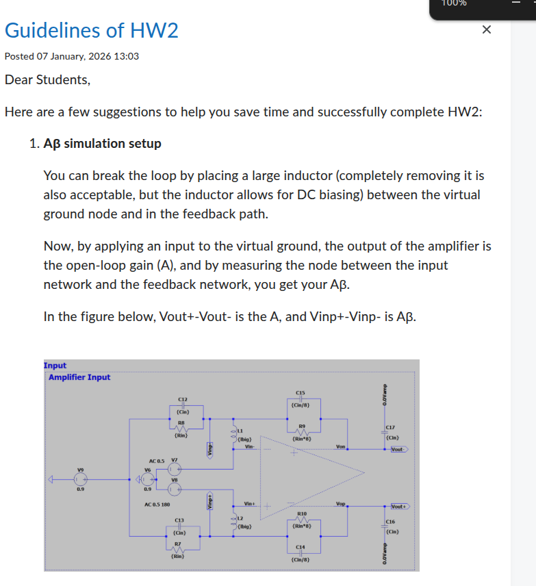

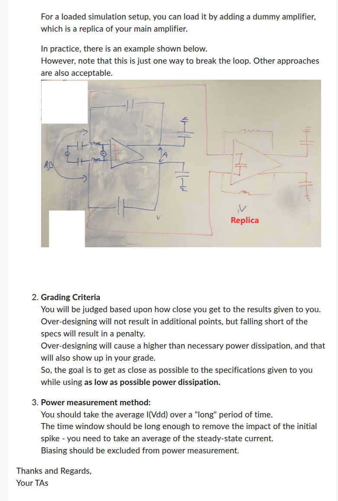

---

## 15. QUICK REFERENCE - MY DESIGN TARGETS

```
=== SPECS TO HIT (NOT EXCEED) ===
A_settle  = 63 dB      (settling accuracy at T_settle)
T_settle  = 2.8 us     (settling time)
SNR       = 80.64 dB   (signal-to-noise ratio)

=== FIXED VALUES ===
A_cl      = 8x = 18.06 dB
V_dd      = 1.8 V
V_out_step = 1.2 V_pd
V_in_step  = 150 mV
V_out_rms  = 0.8485 V_rms
V_cm_out   = 0.9 V

=== DERIVED ESTIMATES ===
tau_cl    ~ 386 ns
BW_cl     ~ 0.412 MHz
f_unity   ~ 3.30 MHz
V_noise   ~ 78.8 uV_rms (noise floor from SNR)

=== MINIMIZE ===
Power dissipation (I_Vdd * 1.8V)

=== FoM TARGET ===
FoM_dB >= 174 dB (higher is better)
Bonus = 0 dB
```

---

## 16. FILES IN THIS PROJECT

| File | Description |
|------|-------------|
| `Project EE4520 2025-2026 (HW2).pdf` | Official homework assignment (17 pages) |
| `Discrete-time_Folded-Cascode_Amplifier_Report_Old_Student.pdf` | Reference report from old student |
| `my_values.png` | Personal target specifications screenshot |
| `assistance/image.png` | Professor's Cadence schematic for A*beta simulation |
| `assistance/image copy.png` | Professor's whiteboard sketch - loop break with replica |
| `assistance/image copy 2.png` | TA Guidelines page 1 (A*beta setup + schematic) |
| `assistance/image copy 3.png` | TA Guidelines page 2 (grading criteria + power measurement) |
| `claude_context/HW2_FULL_CONTEXT.md` | This file - complete design context |

### All Figures (Embedded)

All circuit schematics are embedded inline above (Figs 1-6). The example simulation plots from the PDF are shown below for reference on what the deliverables should look like:

#### Example: Table of Results Format
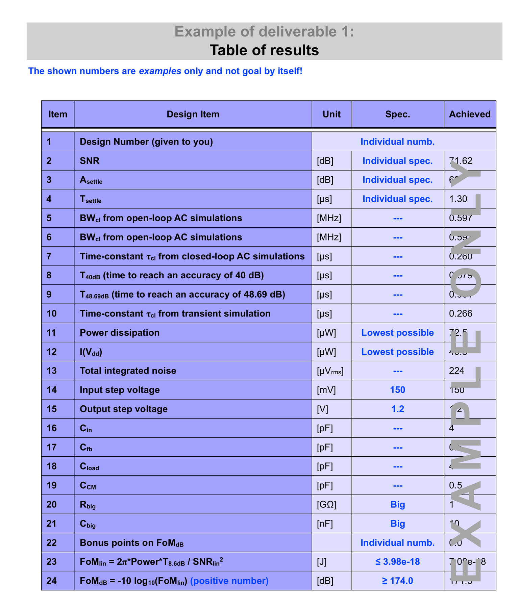

#### Example: Node Voltages (Deliverable 2)
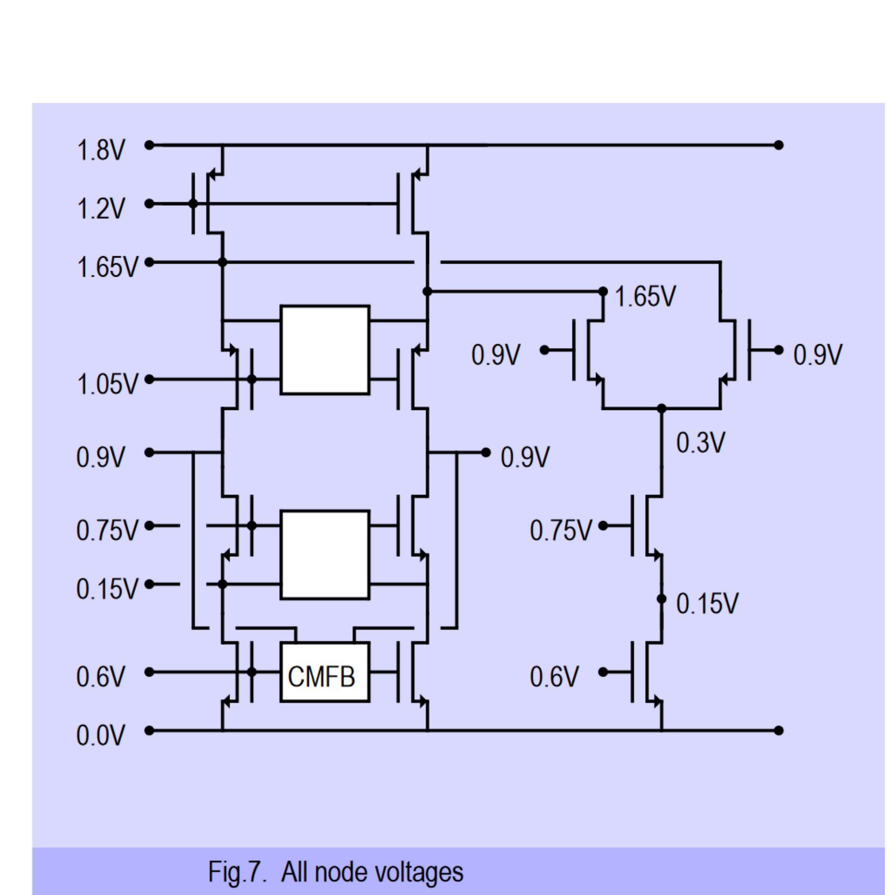

#### Example: Branch Currents (Deliverable 3)
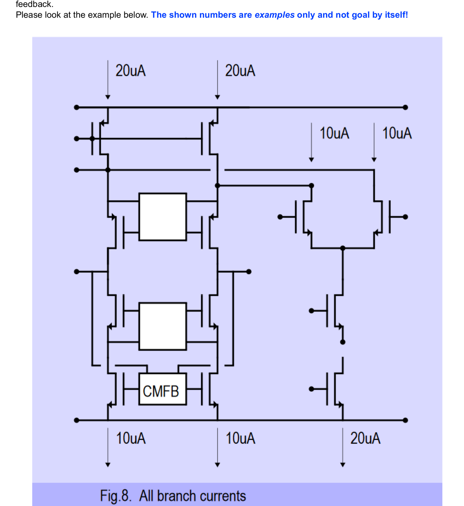

#### Example: Bode Diagram of A and A*beta (Deliverable 4)
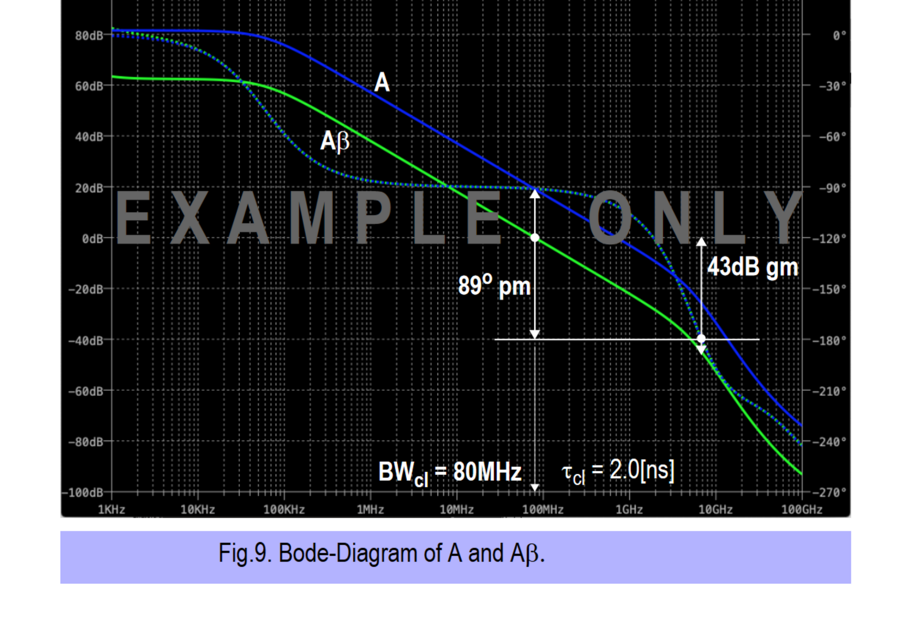

#### Example: Closed-Loop Bode Diagram (Deliverable 5)
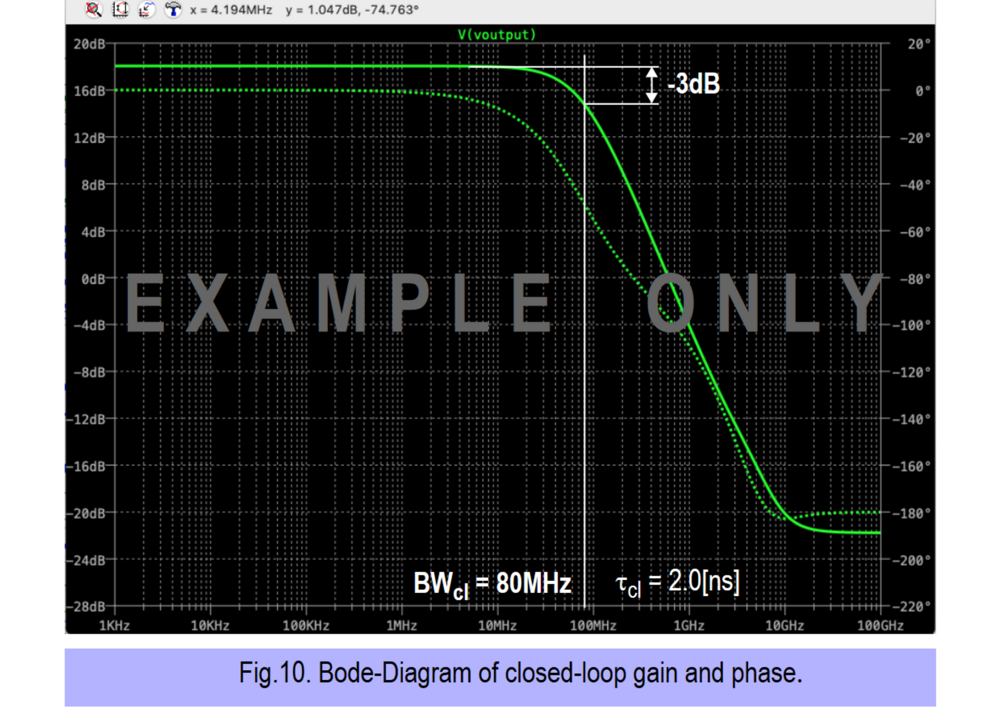

#### Example: Settling Accuracy vs Time (Deliverable 6)
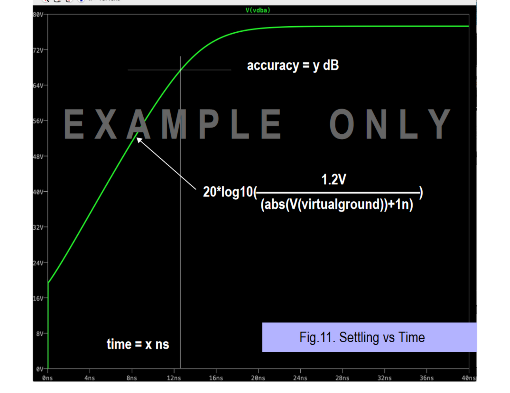

#### Example: Settling with T_settle, T_40dB, T_48.69dB (Deliverable 7)
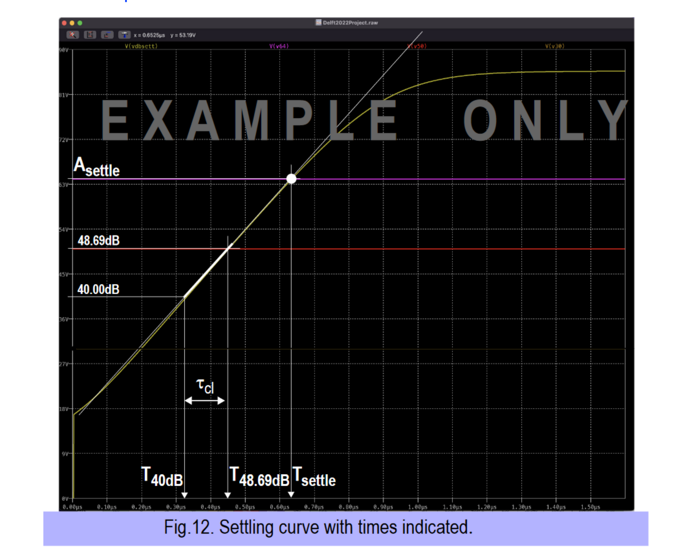

#### Example: Output Noise Power Density (Deliverable 8)
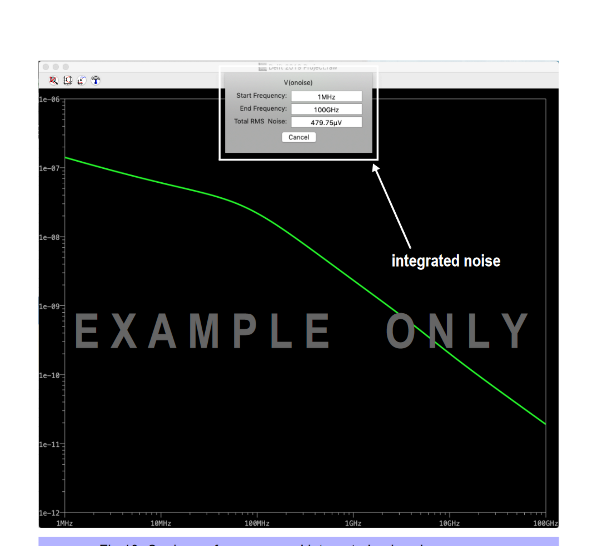
