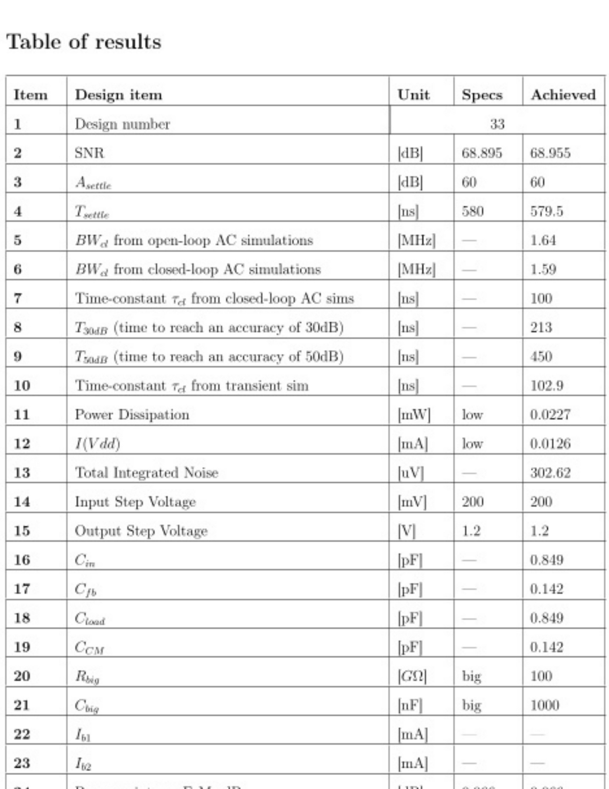
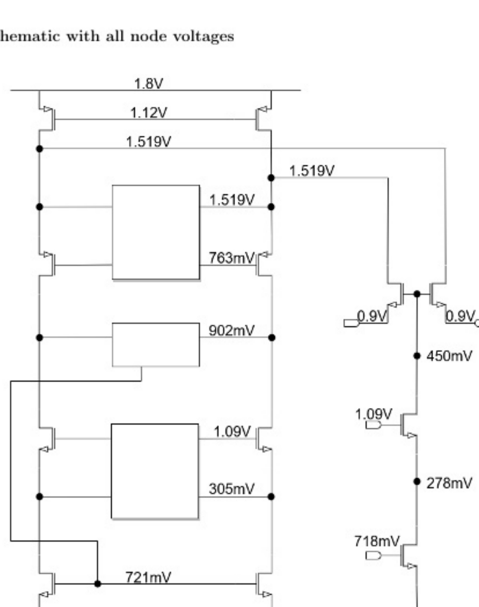
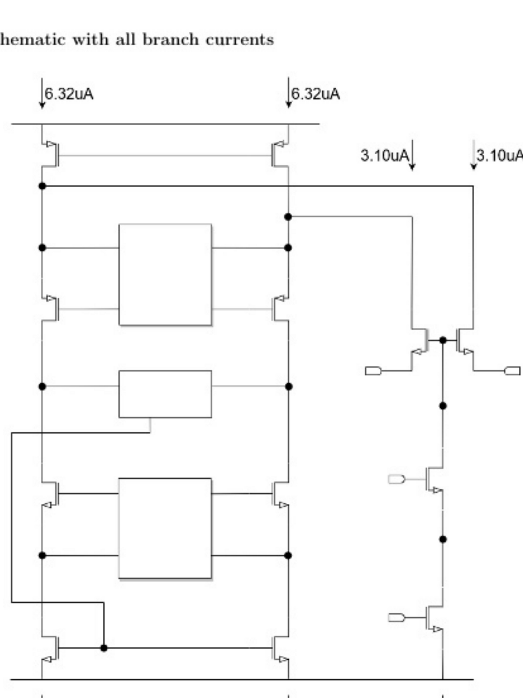
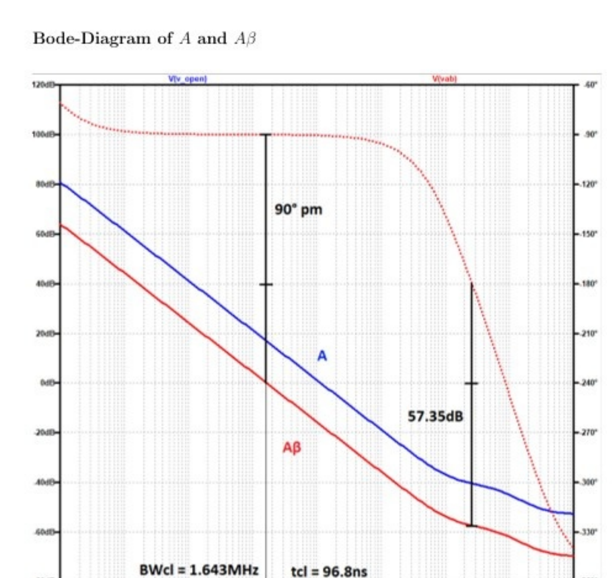
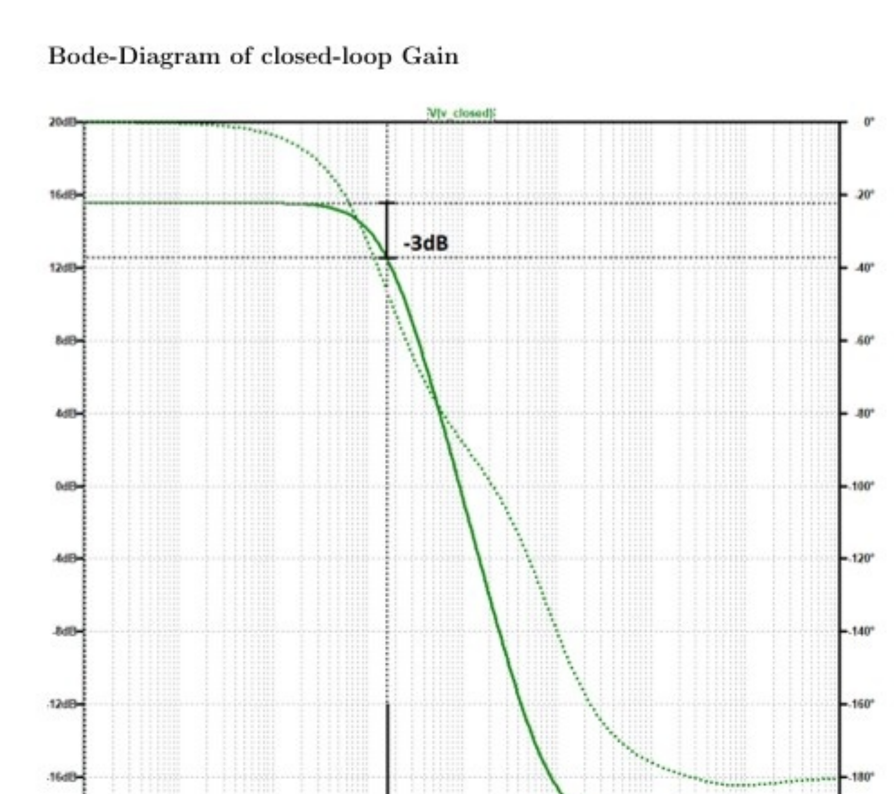
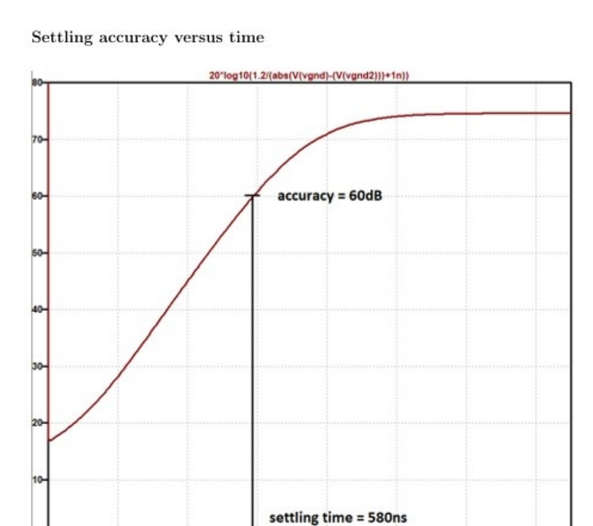
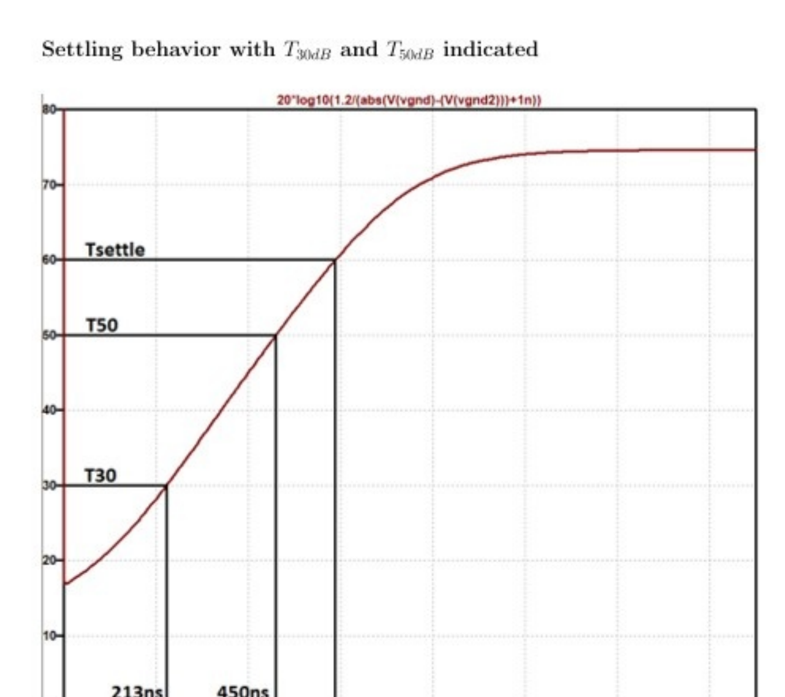
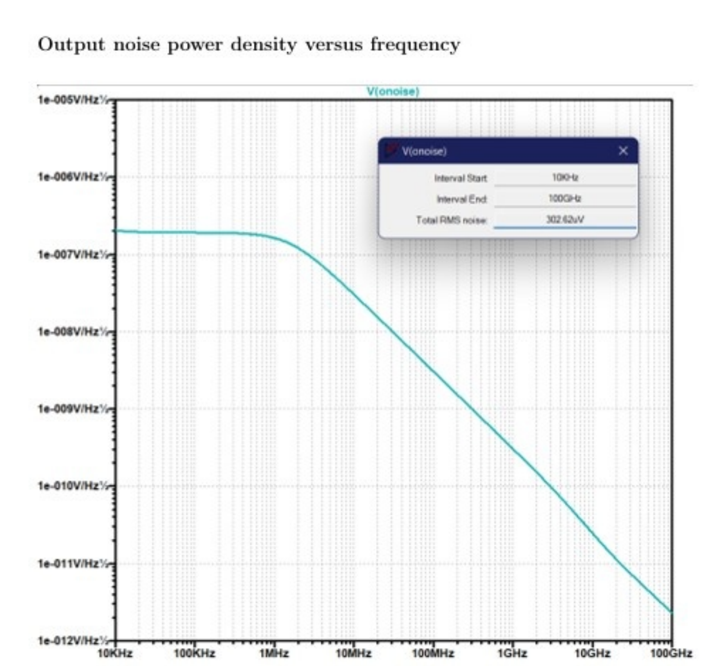
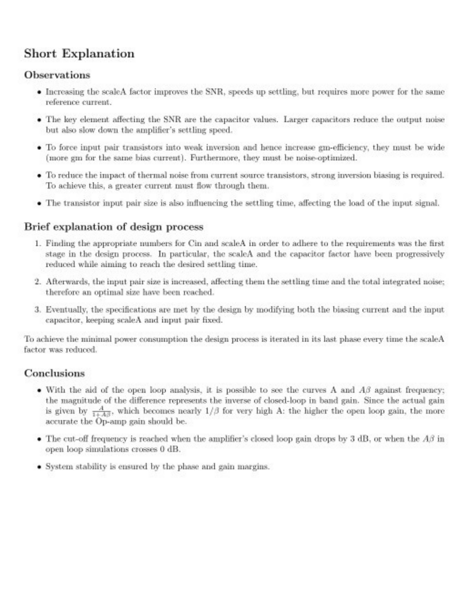

# Old Student Report Comparison - Design #33 vs My Design #27

## Overview

| | Old Student (Jacopo Costantini) | Me |
|---|---|---|
| **Student Number** | 5610893 | 5714699 |
| **Design Number** | 33 | 27 |
| **Date** | March 2023 | January 2026 |
| **Course** | EE4520 (same) | EE4520 (same) |
| **Circuit** | Folded-cascode + ideal gain-boosting | Folded-cascode + ideal gain-boosting |

---

## 1. HEAD-TO-HEAD SPEC COMPARISON

| Parameter | Unit | Old Student SPEC | Old Student ACHIEVED | My SPEC | My TARGET (derived) |
|-----------|------|-----------------|---------------------|---------|-------------------|
| Design Number | - | 33 | 33 | 27 | 27 |
| **A_cl (closed-loop gain)** | x | **6** | 6 | **8** | 8 |
| **SNR** | dB | 68.895 | 68.955 | **80.64** | >= 80.64 |
| **A_settle** | dB | 60 | 60 | **63** | >= 63 |
| **T_settle** | us | 0.580 | 0.5795 | **2.8** | <= 2.8 |
| V_out step | V | 1.2 | 1.2 | 1.2 | 1.2 |
| V_in step | mV | **200** | 200 | **150** | 150 |
| Bonus on FoM_dB | dB | 0.066 | 0.066 | 0 | 0 |
| **FoM_dB** | dB | --- | **177.35** | **>= 174** | >= 174 |

### Key Differences in Specs

1. **Closed-loop gain:** His A_cl = 6, mine = 8. This means:
   - My C_fb = C_in/8 (his was C_in/6)
   - My input step = 150mV (his = 200mV)
   - My feedback factor beta = 1/8 = 0.125 (his = 1/6 = 0.167)
   - **I need higher open-loop unity-gain frequency for same BW_cl** since f_unity = A_cl * BW_cl

2. **SNR:** Mine is 80.64 dB vs his 68.895 dB — a huge **11.7 dB** difference. This means:
   - My max noise = 78.8 uV_rms (his could tolerate much more: ~302.6 uV_rms achieved)
   - **I need ~3.8x lower noise power** (since 11.7 dB ~ factor of 3.85 in power)
   - This will likely require larger capacitors and/or more current

3. **Settling time:** Mine is 2.8 us vs his 580 ns — mine is **4.8x slower** (more relaxed)
   - This is the one spec that works in my favor
   - Less bandwidth needed, potentially lower power possible

4. **Settling accuracy:** Mine is 63 dB vs his 60 dB — I need **3 dB more accuracy**
   - Slightly tighter, but combined with the relaxed T_settle, this is manageable

---

## 2. DERIVED PARAMETER COMPARISON

| Derived Parameter | Old Student | Mine | Notes |
|---|---|---|---|
| tau_cl (estimated) | 8.686 * 580ns / 60 = **83.9 ns** | 8.686 * 2.8us / 63 = **386 ns** | Mine 4.6x slower |
| BW_cl (estimated) | 1 / (2pi*83.9ns) = **1.90 MHz** | 1 / (2pi*386ns) = **0.412 MHz** | Mine 4.6x lower |
| f_unity (estimated) | 6 * 1.90 = **11.4 MHz** | 8 * 0.412 = **3.30 MHz** | Mine 3.5x lower |
| V_noise target | sqrt of (0.8485/10^(68.895/20))^2 ... actual **302.6 uV** | **78.8 uV_rms** | Mine 3.8x tighter |
| SNR_linear | 10^(68.895/20) = **2783** | 10^(80.64/20) = **10764** | Mine 3.87x larger |
| V_signal_rms | 1.2/(2*sqrt(2)) = **0.4243** ... wait his A_cl=6 | 1.2/(2*sqrt(2)) = **0.4243** | Same output swing |

> Wait - the rms signal depends on A_cl and output step. V_out_step = 1.2 V_pd for both. V_out_rms = 1.2 / sqrt(2) = 0.8485 V_rms (same for both since output step is the same).

So noise target:
- Old student: 0.8485 / 2783 = **304.9 uV** (he achieved 302.6 uV — basically on-target)
- Me: 0.8485 / 10764 = **78.8 uV** — I need 3.87x less noise

---

## 3. OLD STUDENT'S ACHIEVED RESULTS (Full Table)

| Item | Parameter | His Achieved |
|------|-----------|-------------|
| BW_cl (open-loop) | 1.64 MHz |
| BW_cl (closed-loop) | 1.59 MHz |
| tau_cl (AC sims) | 100 ns |
| T_30dB | 213 ns |
| T_50dB | 450 ns |
| tau_cl (transient) | 102.9 ns |
| **Power** | **22.7 uW** |
| **I(Vdd)** | **12.6 uA** |
| **Integrated noise** | **302.62 uV** |
| C_in | 0.849 pF |
| C_fb | 0.142 pF |
| C_load | 0.849 pF |
| C_CM | 0.142 pF |
| R_big | 100 GOhm |
| C_big | 1000 nF |
| **FoM_lin** | **1.87e-18 J** |
| **FoM_dB** | **177.35 dB** |

---

## 4. OLD STUDENT'S NODE VOLTAGES (Reference)

**His node voltages (for reference — my values will differ due to different sizing):**

| Node | His Voltage | My Expected Range |
|------|------------|-------------------|
| Vdd | 1.8V | 1.8V (same) |
| Vss | 0V | 0V (same) |
| Mp1/Mp3 drain (Vbp) | 1.12V | Similar |
| Mp2/Mp4 source | 1.519V | Similar |
| Mp2/Mp4 drain (Vcp region) | 763mV | Similar |
| Output CM (Vop/Von) | 902mV | ~900mV (CMFB target = 0.9V) |
| Mn6/Mn8 drain (Vcn region) | 1.09V | Similar |
| Mn6/Mn8 source | 305mV | Similar |
| Mn5/Mn7 (Vbn) | 721mV | Similar |
| Diff pair (Mn3/Mn4) gates | 0.9V | 0.9V (CM input) |
| Diff pair source | 450mV | Similar |
| Mn1/Mn2 drain | 278mV | Similar |
| Mn1 gate (Vbn) | 718mV | Similar |

---

## 5. OLD STUDENT'S BRANCH CURRENTS (Reference)

**His branch currents:**

| Branch | Current |
|--------|---------|
| Mp1, Mp3 (PMOS current sources) | 6.32 uA each |
| Mn3, Mn4 (diff pair) | 3.10 uA each |
| Mn7, Mn8 (tail current, bottom) | 3.22 uA each |
| Mn1 (main current source) | 6.21 uA |
| Total from Vdd | 12.6 uA |

**Current ratio check (his):**
- I_Mp1 = 6.32 uA ≈ 2 * I_Mn7 = 2 * 3.22 = 6.44 uA (close)
- Diff pair current ≈ tail current (Kirchhoff checks out)

---

## 6. OLD STUDENT'S AC RESPONSE

### Open-Loop (A and A*beta)

**His key AC results:**
- DC gain (A): ~120 dB (very high, thanks to gain-boosting)
- Phase margin: **90 degrees** (ideal single-pole)
- Gain margin: **57.35 dB** (excellent)
- BW_cl from A*beta 0dB crossing: **1.643 MHz**
- tau_cl: **96.8 ns**

### Closed-Loop

**His closed-loop results:**
- Passband gain: ~15.6 dB (= 20*log10(6) = 15.56 dB — confirms A_cl = 6)
- BW_cl (-3dB): **1.5899 MHz**
- tau_cl: **100 ns**
- Clean single-pole rolloff

---

## 7. OLD STUDENT'S SETTLING BEHAVIOR

### Settling Accuracy vs Time

- Reaches 60 dB accuracy at ~580 ns (matching his T_settle spec)
- Clean exponential-like settling curve
- His settling formula: `20*log10(1.2/(abs(V(vgnd)-V(vgnd2)))+1n))`
  - Note: he used V(vgnd)-V(vgnd2) for differential virtual ground measurement

### Settling with T_30dB and T_50dB

- **T_30dB = 213 ns** (time to reach 30 dB accuracy)
- **T_50dB = 450 ns** (time to reach 50 dB accuracy)
- T_settle marked at the 60 dB crossing
- tau_cl from transient: (450-213) * 8.686 / (50-30) = 237 * 8.686 / 20 = **102.9 ns** (matches his table)

**For my design, the equivalent thresholds are T_40dB and T_48.69dB** (different from his T_30dB / T_50dB).

---

## 8. OLD STUDENT'S NOISE

- Integration range: **10 kHz to 100 GHz** (same as mine)
- Total RMS noise: **302.62 uV**
- His noise spec was ~305 uV — he hit it almost exactly
- Noise density shape: flat from ~10kHz to ~1MHz, then rolls off at -20dB/dec (thermal noise through 1st-order filtering)

**For my design:** I need 78.8 uV — approximately **3.8x lower noise**. This means:
- I need ~15x more capacitance (noise power ∝ kT/C, so 3.8x lower noise voltage = 3.8^2 = 14.4x more C)
- OR more gm (larger transistors / more current) to push noise corner down
- OR a combination of both

---

## 9. OLD STUDENT'S DESIGN PROCESS

### His 3-Step Design Flow:
1. **Find appropriate C_in and ScaleA** to meet requirements. ScaleA and capacitor factor were progressively reduced while aiming for settling time.
2. **Increase input pair size** — affects settling time and total integrated noise; found optimal size for balance.
3. **Modify biasing current and input capacitor**, keeping ScaleA and input pair fixed. In last phase, reduced ScaleA every iteration to minimize power.

### His Key Observations:
- Increasing ScaleA improves SNR, speeds settling, but requires more power
- **Capacitor values are the key element affecting SNR** — larger caps reduce noise but slow settling
- Input pair transistors should be in **weak inversion** (wide W) for gm/Id efficiency
- To reduce thermal noise from current sources, use **strong inversion biasing** (more current through them)
- Input pair size also affects settling time (loads the input signal)

### His Conclusions:
- Open-loop analysis shows A and A*beta; the difference represents inverse of closed-loop in-band gain
- Actual gain = A/(1+A*beta), which ≈ 1/beta for large A
- Cut-off frequency = when closed-loop drops 3 dB, or when A*beta crosses 0 dB
- Stability ensured by phase and gain margins

---

## 10. WHAT'S THE SAME (Can Follow Directly)

| Aspect | Details |
|--------|---------|
| Circuit topology | Identical: folded-cascode + ideal gain-boosting (A_add=100) + ideal CMFB |
| Technology | 0.18um CMOS, same process files |
| Supply | Vdd = 1.8V, Vddb = 1.8V separate |
| Output CM | 0.9V (CMFB target) |
| Output step | 1.2 V_pd |
| Sizing rules | W=1um, L=0.18um, only m varies; ScaleA + mp-ratio |
| Capacitor ratios | C_load = C_in, C_CM = C_fb (same structure, different A_cl ratio) |
| R_big, C_big | 100 GOhm, 1000 nF (same) |
| Simulation setup | AC: 1Hz-100GHz; Noise: 10kHz-100GHz |
| Design flow | Same 3-step approach works: (1) find C_in/ScaleA, (2) tune input pair, (3) minimize power |
| Deliverable format | Same 10-page structure |
| FoM formula | Same: FoM_lin = 2pi * Power * T_8.6dB / SNR_lin^2 |

---

## 11. WHAT'S DIFFERENT (Must Adapt)

| Aspect | Old Student | Me | Impact |
|--------|------------|-----|--------|
| **A_cl** | 6 | **8** | Different C_fb/C_in ratio; different feedback factor; different f_unity requirement |
| **C_fb** | C_in / 6 | **C_in / 8** | Smaller feedback cap for same C_in |
| **V_in step** | 200 mV | **150 mV** | Smaller input swing (matches higher A_cl) |
| **SNR** | 68.9 dB | **80.64 dB** | ~3.87x tighter noise; may need much larger C_in or more current |
| **A_settle** | 60 dB | **63 dB** | 3 dB more accuracy; need slightly better settling |
| **T_settle** | 580 ns | **2.8 us** | 4.8x more time — major relaxation; can use less BW/power |
| **Settling thresholds** | T_30dB, T_50dB | **T_40dB, T_48.69dB** | Different measurement points on settling curve |
| **Noise budget** | ~305 uV | **78.8 uV** | Need ~15x larger C or proportionally more gm |
| **BW_cl needed** | ~1.9 MHz | **~0.41 MHz** | 4.6x less bandwidth — saves power |
| **f_unity needed** | ~11.4 MHz | **~3.3 MHz** | 3.5x less — significant power savings potential |
| **Bonus** | 0.066 dB | **0 dB** | Negligible difference |

---

## 12. STRATEGY: Adapting His Flow to My Specs

### The Fundamental Trade-off Shift
His design was **speed-limited** (needed fast settling in 580ns). My design is **noise-limited** (need 78.8 uV noise with relaxed 2.8us settling). This fundamentally changes the optimization strategy:

- **His priority:** Fast enough BW → needed high gm → needed more current → power
- **My priority:** Low enough noise → need larger C_in (or more gm) → but BW is relaxed → can potentially use less current if C is sized right

### Adapted 3-Step Flow

**Step 1: Start from noise requirement**
- Calculate minimum C_in from kT/C noise to meet 78.8 uV target
- Rough estimate: V_noise^2 ≈ kT/C_load → C_min ≈ kT / V_noise^2
- kT = 4.14e-21 J at 300K
- C_min ≈ 4.14e-21 / (78.8e-6)^2 = 4.14e-21 / 6.21e-9 ≈ **0.67 pF** (bare minimum from kT/C alone)
- But actual circuit noise is higher (multiple noise sources), so expect C_in in the **1-5 pF range**
- His C_in was 0.849 pF with 302 uV noise; I need ~15x less noise power, so roughly C_in ≈ 0.849 * 14.4 ≈ **~12 pF** if scaling by C alone (unrealistic — will need gm help too)

**Step 2: Choose ScaleA for settling**
- Required tau_cl ≈ 386 ns → BW_cl ≈ 0.412 MHz → f_unity ≈ 3.3 MHz
- This is 3.5x less than his, so ScaleA can likely be smaller
- But larger C_in means more gm needed to maintain same BW → may partially offset

**Step 3: Iterate to minimize power**
- Tune bias current, input pair size, C_in together
- The noise-BW trade-off is the critical balance
- Every reduction in C_in that still meets noise must be offset by more gm
- Every reduction in current must be checked against both BW and noise

### Expected Order of Magnitude
- His power: 22.7 uW with BW=1.6MHz, noise=302uV
- My BW is 4x lower (saves power), but my noise is 3.8x tighter (costs power in C or gm)
- Rough expectation: similar power range, maybe slightly higher due to noise dominance
- Target: FoM_dB >= 174 dB (his achieved 177.35 — but with different specs and bonus)

---

## 13. REFERENCE: Old Student's Simulation Figures Side-by-Side Guide

When building my simulations, use these as visual references for what the plots should look like:

| Deliverable | Old Student Reference | My Equivalent |
|------------|----------------------|---------------|
| Del. 2: Node Voltages |  | Same schematic style, my voltage values |
| Del. 3: Branch Currents |  | Same style, my current values |
| Del. 4: Bode A & Abeta |  | Same plot format; my BW_cl ≈ 0.41 MHz |
| Del. 5: Closed-Loop Bode |  | Same format; my passband = 18.06 dB (not 15.6) |
| Del. 6: Settling |  | Same format; mark 63 dB at 2.8 us |
| Del. 7: Settling + Times |  | Same format; mark T_40dB, T_48.69dB (not T_30/T_50) |
| Del. 8: Noise Density |  | Same format; my total must be <= 78.8 uV |
