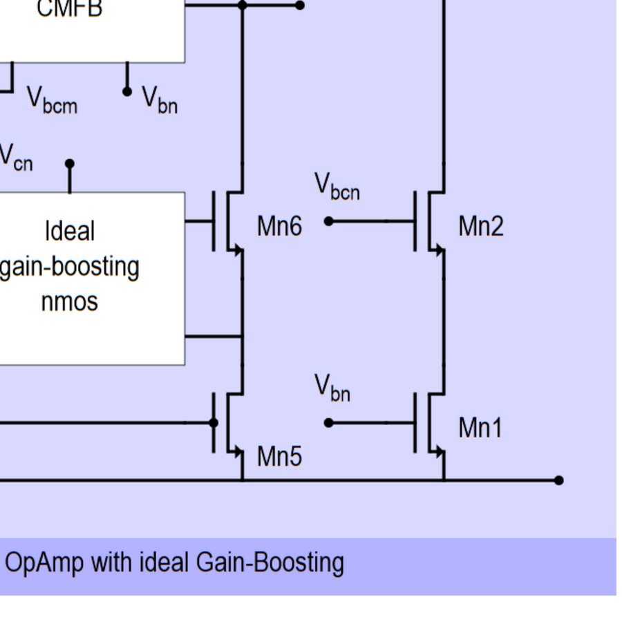
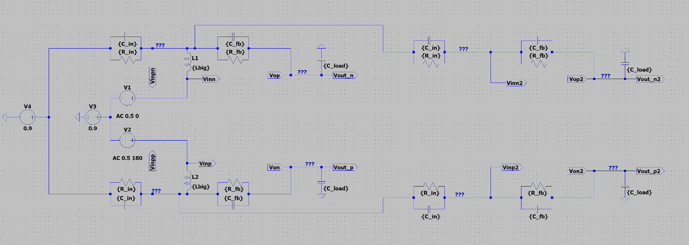
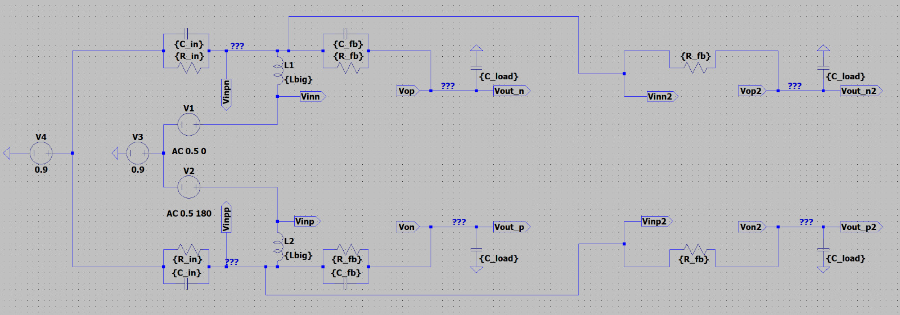

# HW2 - Q&A from Student Group Chat

Clarifications gathered from the student WhatsApp group that resolve ambiguities in the assignment.

---

## Q1: Two different schematics — which one to use?

**Question (Henry Grote):** The schematic given in the assignment (Fig. 1) and the one in the TA announcement don't seem to match. The TAs are applying the signal directly to the input of the op amp instead of to the C_in. Which configuration should I use?

He compared these two schematics:

**TA's LTspice schematic** (from the guidelines announcement — AC sources at virtual ground, inductors breaking loop):

**Original Fig. 1** from the assignment PDF (standard feedback topology):

**Answer (Gauthier Gluckmann):**
> "The new one for open loop sim, the purple one for everything else."

### Takeaway:
| Simulation Type | Which Schematic to Use |
|---|---|
| **Open-loop AC sim** (measuring A and A*beta) | TA's schematic — AC sources at virtual ground, inductors breaking loop |
| **Transient settling** | Original Fig. 1 — full feedback topology with C_in, C_fb, C_load |
| **Closed-loop AC sim** | Original Fig. 1 — full feedback topology |
| **Noise simulation** | Original Fig. 1 — full feedback topology |

This means you need **two testbench configurations** in LTspice:
1. An **open-loop testbench** with the loop broken (TA's version) for A/A*beta Bode plots
2. A **closed-loop testbench** (Fig. 1 from assignment) for transient, closed-loop AC, and noise

---

## Q2: Is "Vbcn" label a mistake in the schematic?

**Question (student):** Looking at the OpAmp schematic (Fig. 2), is the label "Vbcn" on the NMOS gain-boosting side a mistake? Is it supposed to be something else?

**Context:** In the schematic, the node labeled "Vbcn" appears at the gate of Mn6, coming out of the ideal NMOS gain-boosting block. Here is the area in question (zoomed):

You can see: Vcn goes **into** the "Ideal gain-boosting nmos" block, and **Vbcn** comes **out** to the gates of Mn6/Mn2.

**Answers:**
- **Matas:** "Cascode bias from hw1?"
- **Danae Metaxaki:** "The opamp schematic from hw2. I think it should be Vcn."
- **Pratham Dighe** (with screenshot of the gain-boosting block internals): "It's exactly the same as VCN." He showed the ideal NMOS gain-boosting implementation where E3 is a 1x voltage source that copies Vcn.

The ideal NMOS gain-boosting implementation (Fig. 4) shows how this works:

The bottom voltage source (1 x Vcn) copies Vcn exactly at DC. The two A_add/2 sources add the gain-boosted error signal on top of that.

### Takeaway:
**Vbcn = Vcn at DC.** The ideal NMOS gain-boosting block contains a 1x buffer (E3) that copies Vcn to establish the DC bias point, plus the A_add-scaled differential sources for the actual gain-boosting. So at the operating point, Vbcn is exactly equal to Vcn.

In your implementation:
- The Vcn bias voltage comes from the biasing circuit (HW1)
- The ideal GB NMOS block takes Vcn as a reference input and produces Vbcn at the gates of Mn6/Mn8
- **At DC:** Vbcn = Vcn (the 1x buffer sets the operating point)
- **At AC:** Vbcn = Vcn + A_add * Vgn (the gain-boosting adds the amplified error signal)

So there is no mistake — "Vbcn" is technically the output of the gain-boosting block (which equals Vcn at DC), and you can think of it as the "boosted Vcn."

---

## Q3: Replica amplifier in open-loop sim — should it include feedback capacitors?

This is a critical clarification for the **A / A*beta open-loop testbench**.

### Background

The professor's whiteboard sketch shows that for a **loaded** open-loop simulation, you add a **replica (dummy) amplifier** to load the output of the main amplifier, so the output sees the correct impedance during AC analysis:

- **Left (blue):** Main amplifier with loop broken. AC sources applied at virtual ground. Inductors (L_big) break the AC loop. A*beta measured at input side, A measured at output.
- **Right (red, "Replica"):** A copy of the amplifier + feedback network that loads the main output.

### The Question

**Question (Djordi):** To do the loaded simulation (A and A*beta graph), should the replica have the feedback capacitors as well, or just the feedback resistors as drawn? Because the results are quite different.

He built two versions in LTspice:

**WRONG — Replica WITH full feedback network (C_in, R_in, C_fb, R_fb, C_load):**

The replica (right side) includes ALL components: C_in, R_in, C_fb, R_fb, and C_load — a complete mirror of the feedback network.

**CORRECT — Replica WITHOUT feedback capacitors (only R_fb, C_load):**

The replica (right side) only has R_fb and C_load — **no C_in or C_fb capacitors**.

### TA's Official Answer (Avish Gupta)

> "The second one is correct. You should **not** put the feedback capacitor in the dummy amplifier. You already load your amplifier with the feedback capacitor in the main amplifier. That will also add a second pole to your system, potentially making it unstable."

### Takeaway

**DO NOT include C_fb or C_in in the replica amplifier.** The replica should only have:
- **R_fb** (feedback resistors — for DC biasing only, since R = 800 GOhm)
- **R_in** (input resistors — for DC biasing only, since R = 100 GOhm)
- **C_load** (load capacitance — this IS needed to present the correct capacitive load)

**Why this matters:**
1. The main amplifier already has C_fb in its feedback path — this is the capacitance that creates the dominant pole and determines the loop gain rolloff
2. Adding C_fb to the replica would create an **additional capacitive load** at the output that doesn't exist in the real closed-loop circuit
3. This extra capacitance would introduce a **second pole**, shifting your phase margin and potentially making the system appear unstable when it isn't
4. The R_fb and R_in resistors are so large (100-800 GOhm) that they have negligible AC effect — they're only there for DC bias point establishment
5. C_load is needed on the replica because in the real circuit, each output does see C_load to ground

### Open-Loop Testbench Component Summary

| Component | Main Amplifier Side | Replica Side |
|---|---|---|
| C_in | YES | **NO** |
| R_in | YES | YES (DC bias only) |
| C_fb | YES | **NO** |
| R_fb | YES | YES (DC bias only) |
| C_load | YES | YES |
| L_big (inductors) | YES (break loop) | NO |
| AC sources (V1-V4) | YES | NO |
| OpAmp | YES (your design) | YES (copy of your design) |

### Reference: The TA's simpler open-loop schematic (without replica)

For comparison, the TA's original simpler schematic (from the guidelines post) does NOT include a replica at all — it just has the main amplifier with the loop broken:

This simpler version works but doesn't account for the loading effect of a second amplifier. The replica approach is more accurate if you want to model the true output loading. Both are acceptable per the TA guidelines.
