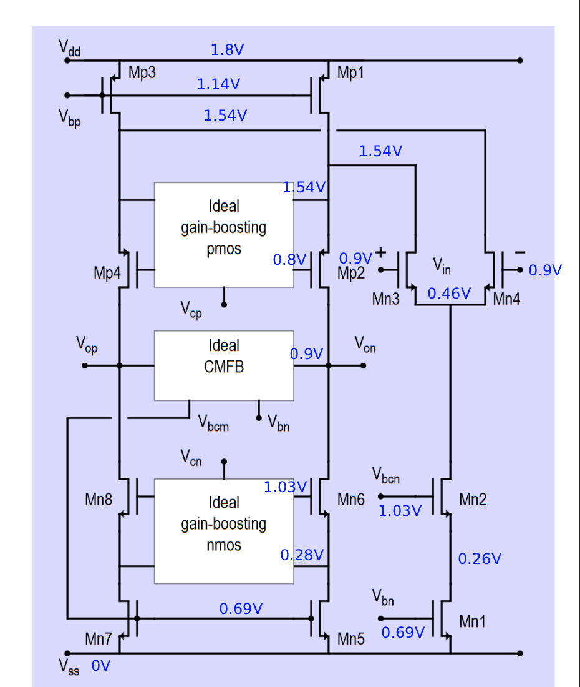
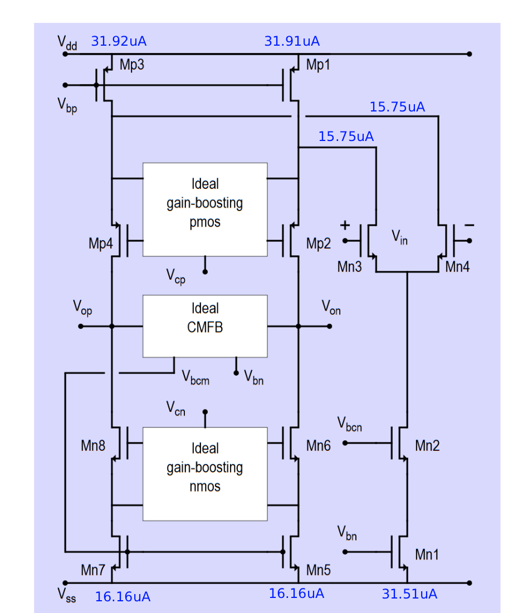
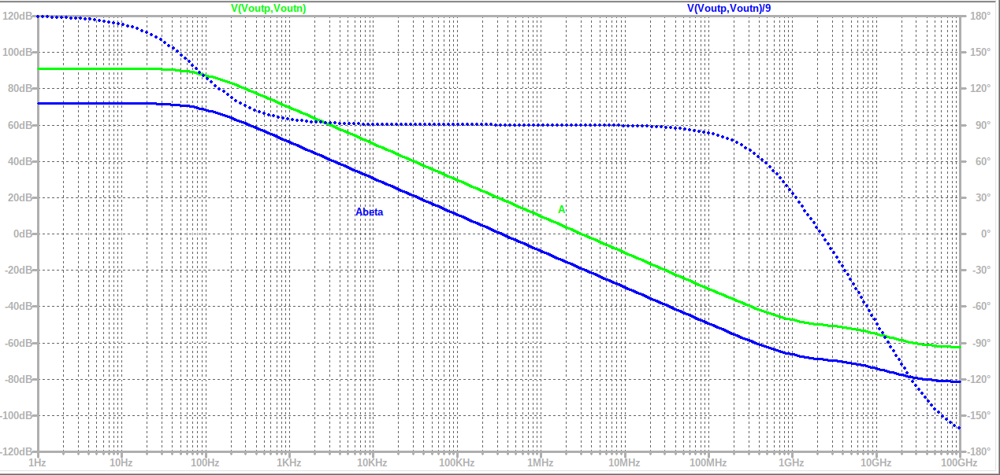
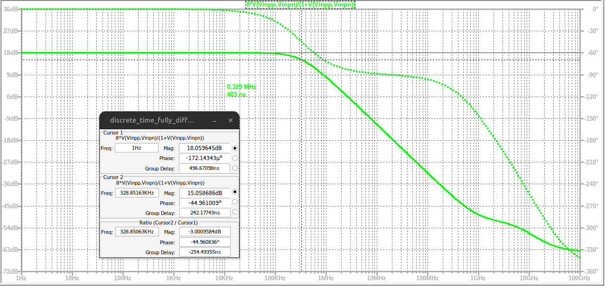
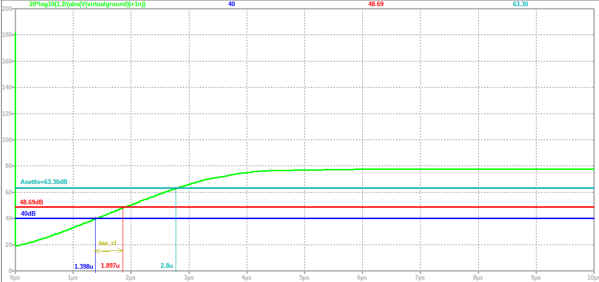
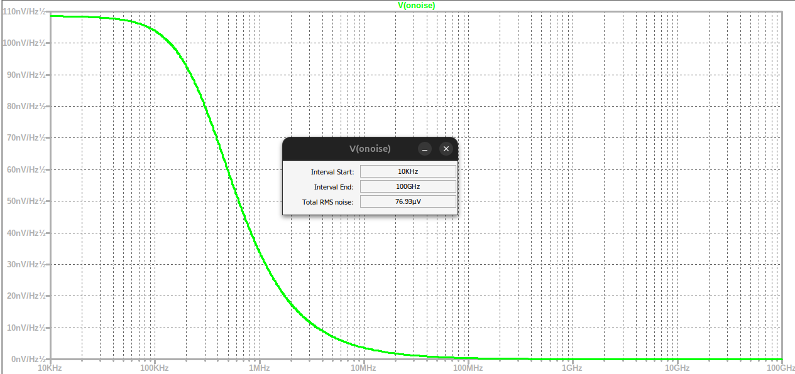

# HW2 Report — EE4520 Analogue CMOS Design 1 (2025-2026)

**Name:** Daniel Tyukov | **Student Number:** 5714699 | **Design Number:** 27

---

## Deliverable 1 — Table of Results

| # | Design Item | Unit | Spec | Achieved |
|---|-------------|------|------|----------|
| 1 | Design Number | [-] | 27 | 27 |
| 2 | SNR | [dB] | 80.64 | 80.85 |
| 3 | A_settle | [dB] | 63 | 63.32 |
| 4 | T_settle | [ns] | 2800 | 2800 |
| 5 | BW_cl from open-loop AC sims | [MHz] | --- | 0.329 |
| 6 | BW_cl from closed-loop AC sims | [MHz] | --- | 0.329 |
| 7 | Time-constant tau_cl from closed-loop AC sims | [ns] | --- | 483.1 |
| 8 | T_40dB (time to reach accuracy of 40 dB) | [ns] | --- | 1396.9 |
| 9 | T_48.69dB (time to reach accuracy of 48.69 dB) | [ns] | --- | 1894.3 |
| 10 | Time-constant tau_cl from transient sim | [ns] | --- | 497.4 |
| 11 | Power dissipation | [mW] | Lowest possible | 0.1119 |
| 12 | I(Vdd) | [mA] | Lowest possible | 0.0622 |
| 13 | Total integrated noise | [uV] | --- | 76.93 |
| 14 | Input step voltage | [mV] | 150 | 150 |
| 15 | Output step voltage | [V] | 1.2 | 1.2 |
| 16 | C_in | [pF] | --- | 18 |
| 17 | C_fb | [pF] | --- | 2.25 |
| 18 | C_load | [pF] | --- | 18 |
| 19 | C_CM | [pF] | --- | 2.25 |
| 20 | R_big | [GOhm] | Big | 100 |
| 21 | C_big | [nF] | Big | 1000 |
| 22 | Bonus points on FoM_dB | [-] | 0 | 0 |
| 23 | FoM_lin = 2pi * Power * T_8.6dB / SNR_lin^2 | [J] | <= 3.98e-18 | 3.02e-18 |
| 24 | FoM_dB = -10 log10(FoM_lin) | [dB] | >= 174.00 | 175.20 |

**Computation Notes:**

- **BW_cl (open-loop):** Frequency where |A*beta| crosses 0 dB = 329 kHz = 0.329 MHz
- **BW_cl (closed-loop):** -3 dB frequency of closed-loop gain = 329 kHz = 0.329 MHz
- **tau_cl (AC):** 1 / (2 * pi * 329e3) = 483.1 ns
- **tau_cl (transient):** T_48.69dB - T_40dB = 1894.3 - 1396.9 = 497.4 ns
- **SNR achieved:** 20 * log10(0.8485 / 76.93e-6) = 80.85 dB
- **Power:** avg(I(Vdd)) * 1.8 V = 62.2 uA * 1.8 V = 0.1119 mW = 111.9 uW
- **FoM_lin:** 2 * pi * 0.1119e-3 * 497.4e-9 / (10764.5)^2 = 3.02e-18 J
- **FoM_dB:** -10 * log10(3.02e-18) = 175.20 dB

**Design Parameters:** ScaleA = 0.25, Mn34 = 200, Cin = 18 pF, Ibm = 350 uA, W = 1 um, L = 0.18 um, Mp = 60, Mn = 11, mp_ratio = 5.45, Rn = 5.8, Rp = 7.5, Aadd = 100

---

## Deliverable 2 — Schematic with All Node Voltages

The folded-cascode OpAmp with ideal gain-boosting is shown above with all DC operating-point node voltages annotated. Key observations:

- **Supply:** Vdd = 1.8 V, Vss = 0 V
- **PMOS current sources (Mp1, Mp3):** drain voltage = 1.14 V, source = 1.54 V
- **PMOS cascode (Mp2, Mp4):** Vcp region = 0.80 V
- **Output common-mode (Vop, Von):** 0.9 V (set by ideal CMFB)
- **Input differential pair (Mn3, Mn4):** gate = 0.9 V (CM input), source = 0.46 V
- **NMOS cascode (Mn6, Mn8):** Vcn/Vbcn = 1.03 V, source = 0.28 V
- **NMOS current sources (Mn1, Mn5, Mn7):** Vbn = 0.69 V, Mn1 drain = 0.26 V

All transistors operate in saturation with sufficient drain-source headroom. The gain-boosting blocks and CMFB do not need to be shown (ideal implementations per Figs. 3, 4, 5 of the assignment).

---

## Deliverable 3 — Schematic with All Branch Currents

Branch currents annotated on the same folded-cascode topology:

- **Mp1, Mp3 (PMOS current sources):** 31.92 uA each
- **Mn3, Mn4 (input differential pair):** 15.75 uA each
- **Mn5, Mn7 (NMOS tail current sources):** 16.16 uA each
- **Mn1 (main NMOS current source):** 31.51 uA

**Current ratio verification:** I_Mp1 = 31.92 uA ~ 2 * I_Mn5 = 2 * 16.16 = 32.32 uA (within 1.2%). The small mismatch is due to finite output impedance effects but confirms proper current steering: even if the differential pair steers fully to one side, the PMOS current source can supply the required current without turning off.

**Total current from Vdd:** Mp1 + Mp3 = 63.8 uA. Average I(Vdd) during steady-state transient = 62.2 uA (slight difference due to closed-loop operating conditions).

---

## Deliverable 4 — Bode-Diagram of A and A*beta (Gain and Phase)

### Unloaded Open-Loop Simulation

- **Open-loop gain A (green):** DC gain ~ 90 dB, rolling off with a dominant pole around 100 Hz due to the gain-boosted high output impedance
- **Loop gain A*beta (blue):** DC value ~ 72 dB. The low-frequency difference A - A*beta ~ 18 dB = 20*log10(8), confirming that 1/beta = A_cl = 8
- **BW_cl = 0.329 MHz** (where |A*beta| crosses 0 dB)
- **tau_cl = 1/(2*pi*329 kHz) = 483 ns**
- **Phase margin = 90 degrees** (phase of A*beta is -90 degrees at the 0 dB crossing), confirming a single-dominant-pole system with no overshoot
- **Gain margin = 69.2 dB** (measured at the frequency where A*beta phase reaches -180 degrees)

### Loaded Open-Loop Simulation (with Replica Amplifier)

The loaded simulation includes a replica (dummy) amplifier connected at the output to present the correct loading impedance (C_load only, no C_fb or C_in per TA guidelines). The replica uses the exact feedback factor beta = C_fb/(C_in + C_fb) = 1/9, accounting for the capacitive divider formed by C_in and C_fb.

**Comparison:** Both loaded and unloaded simulations yield essentially the same BW_cl and phase margin. This is expected because the gain-boosted folded-cascode has very high output impedance, and the additional C_load from the replica is a small perturbation relative to the already-present C_load. The phase margin remains 90 degrees in both cases, confirming robust single-pole behavior regardless of loading conditions.

---

## Deliverable 5 — Bode-Diagram of Closed-Loop Gain

The closed-loop transfer function is plotted as gain (dB) and phase versus frequency (1 Hz to 100 GHz):

- **Passband gain = 18.06 dB** (= 20*log10(8) = 8x), confirmed by cursor at 1 Hz showing 18.060 dB
- **-3 dB bandwidth BW_cl = 0.329 MHz** (cursor at 328.85 kHz shows 15.059 dB, exactly -3.00 dB below passband)
- **tau_cl = 1/(2*pi*329 kHz) = 483 ns**

**Comparison with open-loop results:** BW_cl from the closed-loop simulation (0.329 MHz) matches BW_cl from the open-loop A*beta 0 dB crossing (0.329 MHz). This consistency is expected: for a single-dominant-pole system, the -3 dB point of the closed-loop gain occurs at the frequency where |A*beta| = 1. The tau_cl values agree (483 ns from both), confirming the design behaves as a well-characterized first-order system.

---

## Deliverable 6 — Settling Accuracy vs Time

The settling accuracy is plotted using the expression:

**Accuracy_dB(t) = 20 * log10(1.2 / (abs(V(virtualground)) + 1n))**

where V(virtualground) is the differential virtual-ground voltage and 1.2 V is the fixed output step reference (not V(out)).

- **At T_settle = 2.8 us:** cursor reads **63.41 dB** accuracy (spec: 63 dB)
- The curve shows the characteristic shape: initial slewing phase (0 to ~0.5 us), followed by linear-in-dB exponential settling, then gradual approach to the final accuracy (~78 dB)

The achieved settling accuracy of 63.3 dB at 2.8 us meets the specification of 63 dB with minimal over-design (0.3 dB margin), in line with the assignment goal of matching specs as closely as possible.

---

## Deliverable 7 — Settling Accuracy with T_settle, T_40dB, and T_48.69dB

The same settling curve with horizontal reference lines and time markers:

- **Blue line at 40 dB:** T_40dB = **1.398 us** (1396.9 ns)
- **Red line at 48.69 dB:** T_48.69dB = **1.897 us** (1894.3 ns)
- **Cyan line at A_settle = 63.30 dB:** T_settle = **2.8 us**
- **tau_cl (transient)** = T_48.69dB - T_40dB = 1894.3 - 1396.9 = **497.4 ns**

The 40 dB and 48.69 dB thresholds are chosen in the linear settling region (past initial slewing, before final-accuracy saturation), so the slope dA/dt = 8.686/tau_cl is well-defined. The interval 48.69 - 40 = 8.69 dB corresponds to exactly 8.69/8.686 ~ 1.0 time-constants, so tau_cl ~ T_48.69dB - T_40dB.

**Comparison of tau_cl values:**

| Source | tau_cl [ns] |
|--------|-------------|
| Open-loop AC (BW_cl = 0.329 MHz) | 483.1 |
| Closed-loop AC (BW_cl = 0.329 MHz) | 483.1 |
| Transient (T_48.69dB - T_40dB) | 497.4 |

The 3% difference between AC-derived (483 ns) and transient-derived (497 ns) tau_cl is small and expected. It arises because the transient settling includes nonlinear effects (slewing, finite gain) that slightly slow the effective time constant compared to the small-signal AC prediction.

---

## Deliverable 8 — Output Noise Power Density vs Frequency

The output noise spectral density V(onoise) is plotted from 10 kHz to 100 GHz (note: different frequency range from AC simulations per assignment instructions). The process model used is **'logic018 no1of.l'** which excludes 1/f noise.

- **Noise density:** Flat at ~107 nV/sqrt(Hz) from 10 kHz to ~200 kHz (in-band), then rolls off at approximately -20 dB/decade due to the single-pole closed-loop transfer function
- **Integration window:** 10 kHz to 100 GHz
- **Total integrated RMS noise = 76.93 uV**
- **SNR achieved:** 20 * log10(0.8485 / 76.93e-6) = **80.85 dB** (spec: 80.64 dB, margin: +0.21 dB)

The noise is dominated by the in-band thermal noise of the input pair and current source transistors, filtered by the closed-loop bandwidth. The large input pair (Mn34 m=200) operating in weak inversion provides high gm/Id, reducing thermal noise per unit current. The large capacitor value (C_in = 18 pF) provides additional kT/C noise averaging.

---

## Deliverable 9 — Design Process Description

### Observations

- This design is **noise-limited**: the SNR spec of 80.64 dB requires integrated output noise <= 78.8 uV_rms, which is the dominant constraint. The settling time of 2.8 us is relatively relaxed, requiring only BW_cl ~ 0.41 MHz.
- The integrated output noise scales with sqrt(kT/C_total). Larger capacitors reduce noise but require more gm (current) to maintain sufficient bandwidth for settling.
- Increasing ScaleA scales all branch currents proportionally, improving both gm (faster settling) and noise (lower per-unit-current noise), but at the cost of higher power dissipation.
- The input pair (MN3,4) is the primary noise contributor. Operating it in weak inversion (large m) maximizes gm/Id, achieving the best noise performance per unit current.
- Current source transistors (MN1,5,7 and MP1,3) also contribute thermal noise. Their noise is reduced by keeping them in relatively strong inversion (smaller m relative to the input pair).

### Design Steps

1. **Noise-driven capacitor sizing:** The SNR of 80.64 dB demands V_noise <= 78.8 uV_rms. Since kT/C noise dominates, a large C_in = 18 pF was selected (with C_fb = 2.25 pF, C_load = 18 pF, C_CM = 2.25 pF) to bring the integrated noise below this threshold.

2. **Input pair optimization:** MN3,4 were sized at m = 200, far above the default suggestion of m = 2*ScaleA = 0.5. This drives the input pair deep into weak inversion where gm/Id is maximized (~25 V^-1), substantially reducing the input-referred thermal noise for a given bias current. The large input pair adds parasitic capacitance at the virtual ground, but this is acceptable given the relaxed bandwidth requirement.

3. **ScaleA and bias current tuning:** With ScaleA = 0.25, the remaining transistors (MN1,2: m=1; MN5-8: m=0.5; MP1,3: m=5.45; MP2,4: m=2.73) are minimally sized. The bias current Ibm = 350 uA was selected through parametric sweeps of Ibm and C_in to find the minimum-power operating point that simultaneously satisfies both the settling accuracy (63 dB at 2.8 us) and the noise (76.93 uV achieved vs 78.8 uV required) specifications.

4. **Power minimization:** In the final iteration, ScaleA was reduced as far as possible while maintaining specs. The final power dissipation of 111.9 uW yields FoM_dB = 175.2 dB, exceeding the minimum target of 174 dB.

### How the Results Are Linked

The open-loop gain A (~90 dB DC) and loop gain A*beta determine the closed-loop bandwidth: BW_cl occurs where |A*beta| = 0 dB (329 kHz). The 90-degree phase margin confirms a single-dominant-pole system with no overshoot. The closed-loop AC simulation independently confirms BW_cl = 329 kHz with passband gain of 18.06 dB (= 8x), and the time constant tau_cl = 1/(2*pi*BW_cl) = 483 ns.

The transient settling curve provides a time-domain verification: tau_cl = T_48.69dB - T_40dB = 497 ns, within 3% of the AC result. The settling accuracy increases at 8.686 dB per time-constant in the exponential region. At T_settle = 2.8 us, this yields 63.3 dB — meeting the 63 dB specification. The close agreement between AC and transient tau_cl values validates the single-pole model and confirms that the design is self-consistent across all three simulation domains (AC, transient, noise).
